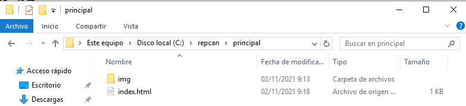
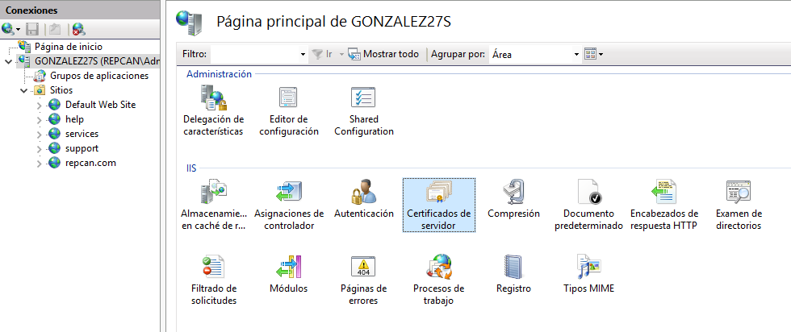
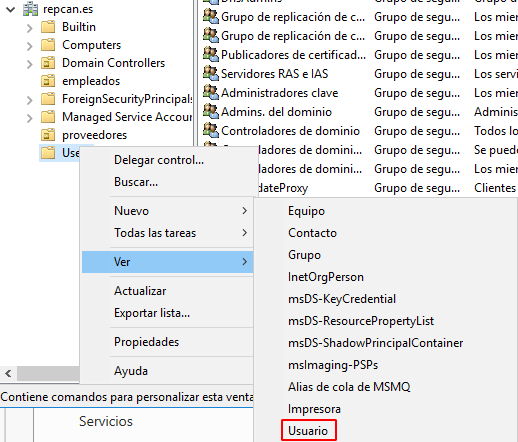

# IIS Servidor Web avanzado - Windows Server

## 1. Crear zona de búsqueda directa ***miEmpresa***

Para realizar esta práctica vamos a crear una zona de búsqueda directa (ZBD) con el nombre de nuestra empresa (en nuestro caso, ***repcan.com***). Para crear la ZBD, vamos a nuestra MV de Windows Server y vamos a `Administrador del servidor -> Herramientas - DNS` :

Ahora vamos a `Server -> ZBD`, le damos clic derecho y seleccionamos `Zona nueva...` :

Los pasos de la ZBD son los siguientes:

* **Tipo de zona:** Principal.

* **Ámbito de replicación de zona:** Para todos los servidores... en este **dominio**.

* **Nombre de la zona:** Nuestra empresa. En nuestro caso, ***repcan.com***.

* **Actualización dinámica:** Sólo actualizaciones seguras.

  

  > ***IMPORTANTE:*** Todos los pasos serán por defecto como está mencionado, lo único que cambiamos es el nombre de la zona.

Con esto ya tendremos la ZBD creada:

---

## 2. Crear sitio web ***www.miEmpresa.com***

Ahora vamos a crear la zona web de la ZBD creada anteriormente. Para empezar, creamos la carpeta `miEmpresa` en la ruta `C:\` y dentro de la carpeta crearemos la subcarpeta `principal`. También se pueden crear las carpetas desde **cmd** utilizando el comando `mkdir` :

Vamos a crear el sitio web. Para ello, vamos a `Administrador del servidor -> Herramientas -> IIS` :

Luego vamos a `Server -> Sitios`, le damos clic derecho y seleccionamos `Agregar sitio web...` :

Al agregar el sitio, debería verse de la siguiente manera:

Ahora volvemos a `Administrador del servidor -> Herramientas - DNS -> Server -> ZBD -> miEmpresa` y dentro le damos clic derecho y seleccionamos `Host nuevo (A o AAAA)...` :

Ponemos el nombre y la dirección IP del equipo servidor:

Ahora le damos de nuevo clic derecho y seleccionamos `Alias nuevo (CNAME)...` :

Ponemos como nombre ***www*** y le asignamos el host que acabamos de agregar:

El dominio debería verse así:

Ahora vamos al explorador de archivos y creamos un fichero ***index.html*** en la ruta `C:\miEmpresa\principal` :

Editamos el fichero, añadimos imágenes y estilos.

Cuando ya esté todo listo, abrimos un navegador y en el cuadro de búsqueda escribimos `www.miEmpresa.com` y nos debería cargar el fichero ***index.html*** creado y modificado anteriormente:

---

## 3. Crear sitio web ***pagos.miEmpresa.com***

En este paso vamos a crear el sitio web ***pagos.miEmpresa.com***, utilizando certificado autofirmado para acceder de forma segura, es decir, mediante `https`.

### 3.1. Crear certificado para acceso HTTPS

Lo primero que haremos es crear la carpeta `pagos` dentro del directorio `C:\repcan` :

Una vez creado el directorio del sitio web, procedemos a ir a **ISS** y en `Server` vamos a `Certificados de servidor` :

Dentro, vamos al lado derecho (`Acciones`) y le damos clic a `Crear certificado autofirmado...` :

Especificamos el nombre y lo almacenamos en el hospedaje de sitios web:

Debería verse así después de crearse:

Ahora vamos a `Server -> Sitios`, le damos clic derecho y le damos a `Agregar sitio web...`. Debe tener los siguientes parámetros:

Ya creado debería aparecer en `Sitios` :

Finalmente, para que nos funcione tanto de manera normal (http) como de manera segura (https), debemos ir a `Sitios -> pagos -> Acciones -> Enlaces...` y definir el sitio que falta:

### 3.2. Crear subdominio

Ahora vamos a `Administrador del servidor -> Herramientas - DNS -> Server -> ZBD -> miEmpresa`, le damos clic derecho y seleccionamos `Dominio nuevo...` :

Ponemos el nombre:

Y finalmente le añadimos el host y el alias:

### 3.3. Comprobación

Vamos al explorador de archivos y creamos un fichero ***index.html*** en la ruta `C:\miEmpresa\pagos` :

Editamos el fichero, añadimos imágenes y estilos.

#### Desde el servidor

Cuando ya esté todo listo, abrimos un navegador y en el cuadro de búsqueda escribimos `www.pagos.miEmpresa.com` y nos debería cargar el fichero ***index.html*** creado y modificado anteriormente:

* De manera normal (http):

  

* De manera segura (https):

  

#### Desde el cliente

Desde el cliente haremos lo mismo, abrimos un navegador y en el cuadro de búsqueda escribimos `www.pagos.miEmpresa.com` y nos debería cargar el fichero ***index.html*** creado y modificado anteriormente:

* De manera normal (http):

  

* De manera segura (https):

  

---

## 4. Crear sitio web ***tienda.miEmpresa.com***

En este paso vamos a crear el sitio web ***tienda.miEmpresa.com***, utilizando certificado OpenSSL para acceder de forma segura.

### 4.1. Instalar OpenSSL

Lo primero es instalar el software e instalarlo. Una vez descargado, realizaremos los pasos de instalación:

* Introducción:

  

* **Términos de licencia:** Leemos y aceptamos:

  

* **Ruta de instalación:** La que queramos:

  

* **Directorio de menú inicio:** Por defecto:

  

* Instalación:

  

Una vez realizados los pasos, ya tendremos instalado OpenSSL.

### 4.2. Generar certificado de servidor

Abrimos el comando y accedemos a la carpeta `C:\OpenSSL\bin` con el comando `cd`. Una vez en la ruta, ejecutamos el comando `openssl genrsa -des3 -out cakey.pem 2048` y creamos una clave. Esto creará una clave privada:

Al abrir el contenido del fichero `cakey.pem` podemos ver la clave:

Ahora vamos a crear el certificado digital de la CA que contendrá información sobre la misma. Para ello, ejecutamos el comando `openssl req -new -x509 -key cakey.pem -out cacert.pem -days 365`. Nos pedirá la clave del fichero `cakey.pem`, nacionalidad, provincia, ciudad, organización (empresa), puesto de organización, nombre y correo, por lo que lo rellenamos:

Al abrir el contenido del fichero `cacert.pem` podemos ver el certificado:

Creamos el fichero `certreq.txt` dentro de la ruta `C:\OpenSSL\bin` con el comando `copy con` :

Vamos a ISS y en `Server` le damos a `Certificados de servidor` :

Dentro le damos clic en `Acciones -> Crear una solicitud de certificado...` :

Rellenamos los campos que se muestran a continuación:

Pondremos el proveedor de servicios criptográficos por defecto y pondremos una longuitud de 4096 bits:

Especificamos la ruta del fichero creado anteriormente:

Y finalizamos. Ahora vamos a crear el certificado digital de nuestra web. Para ello, volvemos a cmd y ejecutamos el comando `openssl x509 -req -days 365 -in certreq.txt -CA cacert.pem -CAkey cakey.pem -CAcreateserial -out iis.crt` :

Al abrir el contenido del fichero `iis.crt` podemos ver el certificado:

### 4.3. Importar certificado

Vamos a `IIS -> Server -> Certificados de servidor -> Acciones` y seleccionamos `Completar solicitud de certificado...` :

Especificamos el certificado `iis.crt`, le pondremos un nombre descriptivo y almacenamos en el hospedaje de sitios web:

### 4.4. Requerir acceso seguro

Ahora creado el certificado y preparado, vamos a crear la estructura de carpetas. Para ello, crearemos la carpeta `tienda` en la ruta `C:\repcan\`, creamos también subcarpetas y el fichero ***index.html***. Creamos las carpetas con el comando `mkdir` y los ficheros con el comando `copy con` :

Vamos a `IIS -> Server -> Sitios`, le damos clic derecho y le damos a crear sitio web. Pondremos los siguientes parámetros:

Luego le damos a `Sitios -> tienda -> Acciones` y le damos clic a `Enlaces...`. Quitamos el enlace **http**, de tal manera que sólo esté el de **https**:

Vamos a `DNS -> Server -> ZBD -> miEmpresa` y creamos el subdominio `tienda`. En él añadimos los hosts y alias correspondientes:

Preparamos los ficheros para la visión del sitio web:

Y ya podemos comprobar.

### 4.5. Comprobación

#### Desde el servidor

* De manera normal (http):

  

* De manera segura (https):

  

  

#### Desde el cliente

* De manera normal (http):

  

* De manera segura (https):

  

> ***IMPORTANTE:*** Como podemos ver, al entrar de manera normal (http), no nos resuelve el sitio web y nos resuelve el sitio web del dominio principal, esto se debe gracias a que quitamos el enlace http al crear el sitio web.
---

## 5. Crear sitio web ***empleados.miEmpresa.com***

Finalmente vamos a crear el sitio ***empleados.miEmpresa.com*** utilizando validación de usuario para su respectiva carpeta o sitio.

Para empezar, accedemos a la ruta `C:\repcan` con el comando `cd` y creamos las carpetas `comun`, `david`, `alejandro` y `alexander`. Utilizaremos el comando `mkdir` y comprobamos con el comando `tree` :

Vamos a `IIS -> Server -> Sitios`, le damos a `Nuevo sitio web...` y creamos el sitio `empleados` con los siguientes parámetros:

Luego en el sitio `empleados`, le damos a `Acciones -> Editar permisos -> Opciones avanzadas`:

Y le damos a `Deshabilitar herencia`. Borramos todas las herencias:

Una vez hecho, vamos a `Administrador del servidor -> Herramientas -> Usuarios y equipos de AD`:

Vamos a `Users`, le damos clic derecho y seleccionamos `Nuevo -> Grupo`:

Creamos el grupo `empleados`:

Seguimos en `Users`, le damos clic derecho y seleccionamos `Nuevo -> Usuario`:

Y creamos los usuarios `david`, `alexander` y `alejandro`:

Ponemos contraseña a cada usuario:

Y el resultado debe verse así:

Le damos clic derecho a los usuarios creados y le damos a `Agregar a un grupo`. Los agregamos al grupo `empleados`:

Comprobamos el grupo `empleados` desde `Propiedades -> Miembros`:

Ahora vamosa a `DNS -> Server -> ZBD` y creamos un dominio nuevo y le agregamos sus respectivos hosts y alias:

Volvemos a `IIS -> Server -> Sitios -> empleados -> Autenticación`, deshabilitamos autenticación anónima y habilitamos autenticación básica:

Ahora preparamos la estructura del sitio web y le damos clic derecho en las carpetas de los usuarios y le damos a `Propiedades`:

Le damos a `Opciones avanzadas`:

Cambiamos el propietario:

Ponemos de propietario el grupo `empleados`:

Ahora le damos a `Agregar`:

Agregammos el `usuario` de la carpeta y le ponemos permisos de `Control total`:

Debería verse así:

Hay que hacer lo mismo con cada carpeta. En el caso de la carpeta común, poner de propietario el grupo y entidad de seguridad `empleados`.

Finalmente abrimos el navegador web y en el cuadro de búsqueda buscamos `www.empleados.miEmpresa.com` y nos saldrá un index de chequeo de empleados. Sólo se podrá acceder a la carpeta el usuario de la misma, por lo que pedirá usuario y contraseña (exepto la carpeta común, que todos tienen acceso a él):

Al loguearse correctamente, se abrirá su sitio web.

* David:

  

* Alejandro:

  

* Alexander:

  

* Común:

  
