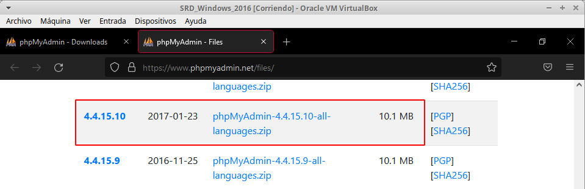
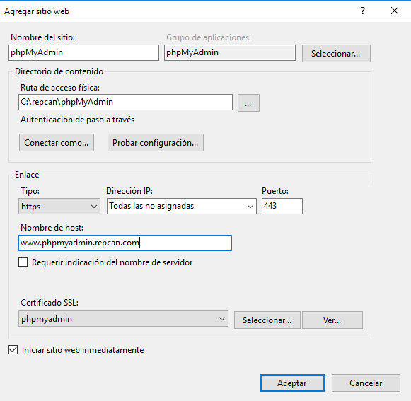

# IIS Servidor Web avanzado - PHP, MySQL, phpMyAdmin, FTP y Drupal

## 1. Instalar PHP

---

## 2. Comprobación PHP

---

## 3. Instalar MySQL

### 3.1. Instalar .NET Framework

### 3.2. Instalar MySQL y complementos

---

## 4. Instalar phpMyAdmin

---

## 5. Filezilla FTP Server

### 5.1. Instalación

### 5.2. Usuario y permisos

### 5.3. Crear registro DNS

---

## 6. Comprobación desde el cliente

### 6.1. Comprobación de acceso a phpMyAdmin

### 6.2. Descargar CMS Drupal

### 6.3. Comprobación de acceso al sitio FTP

### 6.4. Instalar Filezilla FTP Client

### 6.5. Descomprimir y subir archivos Drupal

### 6.6. Crear base de datos y usuario en phpMyAdmin

### 6.7. Instalar CMS Drupal

### 6.8. Configuración y creación del sitio Drupal

