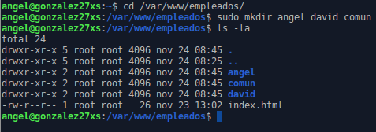

# Servidor Web Apache en Linux

Con esta práctica queremos obtener un conjunto de sitios web similares a los realizados en IIS, es decir, algo semejante a lo siguiente:

* Dominio principal: miempresa.com (o similar)

* Alias página principal: www.miempresa.com

* Sitio seguro (https): pagos.miempresa.com (o miempresa.com/pagos)

* Carpetas privadas protegidas: empleados.miempresa.com (o miempresa.com/empleados)

* Instalación PHP, MySQL, phpMyAdmin

* Gestión bases de datos: phpmyadmin.miempresa.com (o miempresa.com/phpmyadmin)

* Instalación FTP o SSH (opcional)

* Instalación y configuración plataforma Drupal, Joomla, Moodle, Gallery, osCommerce, etc. en página principal

Recordemos que para realizar estos pasos es necesario presindir de una MV Xubuntu o similar en adaptador Puente (acceso a Internet).

## 1. Apache

### 1.1. Instalación

Para comenzar, vamos a instalar Apache. Para ello, abrimos una terminal y ejecutamos el comando `apt install apache2` (requiere usuario ***root***, es decir, debemos utilizar el comando `sudo` en primer lugar de cada comando):

Una vez instalado, vamos a comprobar la carpeta raíz (/var/www/). Para ello, usaremos el comando `tree -a /var/www/`

> La variable `-a` muestra todos los ficheros de todos los directorios.

Ahora comprobamos el acceso a `localhost`. Para ello, abrimos un navegador y en el cuadro de búsqueda introducimos `localhost`. Si Apache se ha instalado correctamente,  debería salir lo siguiente:

### 1.2. Cambiar línea asociada a la IP del servidor

Vamos a hacer que se vea la página anterior pero en vez de escribir `localhost` escribiremos `www.miempresa.com`. Para ello, modificamos el fichero `/etc/hosts` con el comando `nano /etc/hosts` (requiere usuario ***root***) y añadimos la siguiente línea:

~~~
IP.DEL.SERVIDOR.LINUX           www.miempresa.com
~~~

Debería quedar así:

### 1.3. Comprobación

Finalmente volvemos al navegador y en el cuadro de búsqueda escribimos `www.miempresa.com` y comprobamos que funciona correctamente:

Vamos a reiniciar Apache con el comando `/etc/init.d/apache2 restart` (requiere usuario ***root***):

Finalmente vamos a buscar los archivos logs de error y acceso, que están en `/var/log/apache2/`. Vemos el contenido de la carpeta mencionada con el comando `ls -la /var/log/apache2`:

---

## 2. PHP

### 2.1. Instalación

Para instalar PHP vamos a usar el comando `apt install php` (requiere usuario ***root***):

También instalaremos el complemento `libapache2-mod-php`:

### 2.2. Configuración

Vamos a crear y modificar el fichero `index.php` situado en `/var/www/html` y escribimos la siguiente línea:

~~~
<?php phpinfo(); ?>
~~~

> En el directorio **/var/www/html** también tenemos el fichero ***index.html***, que se encarga en mostrar la página de Apache vista anteriormente.

### 2.3. Comprobación

Vamos a comprobar el funcionamiento de php. Para ello, vamos al navegador y en el cuadro de búsqueda introducimos `www.miempresa.com/index.php`:

---

## 3. Virtual Host (Empleados)

### 3.1. Configuración

Vamos a crear un Host Virtual en Apache, es decir, asociar carpetas con sitios web (ej: empleados.miempresa.com --> /var/www/empleados) y establecer configuración (/etc/apache2/sites-available/empleados.conf).

Para empezar, abrimos la terminal y crearemos la carpteta `/var/www/empleados` con el comando `mkdir /var/www/empleados` (requiere usuario ***root***). Comprobamos luego con el comando `ls -la /var/www/`:

Ahora creamos y configuramos el fichero de configuración `/etc/apache2/sites-available/empleados.conf` y le agregamos el siguiente contenido:

~~~
<VirtualHost *:80>

  ServerAdmin webmaster@miempresa.com
  ServerName empleados.miempresa.com
  DocumentRoot /var/www/empleados

</VirtualHost>
~~~

Debería verse así:

Ahora debemos crear el enlace para asociar la carpeta al sitio web y habilitarlo. Para ello, accedemos primero al directorio `/etc/apache2/sites-enabled` con el comando `cd`. Luego creamos el enlace con el comando `ln -s ../sites-available/empleados.conf` (requiere usuario ***root***). Comprobamos luego con el comando `ls -la`:

Modificamos el fichero `/etc/hosts` con el comando `nano /etc/hosts` (requiere usuario ***root***) y añadimos la siguiente línea:

~~~
IP.DEL.SERVIDOR.LINUX           empleados.miempresa.com
~~~

Debería quedar así:

Finalmente creamos y modificamos el archivo `index.html` en el directorio `/var/www/empleados/` con el comando `nano /var/www/empleados/index.html` (requiere usuario ***root***). Pondremos lo que queramos, ya que es lo que veremos en la página web:

### 3.2. Comprobación

Finalmente abrimos el navegador e introducimos `empleados.miempresa.com` en el cuadro de búsqueda. Si lo hemos hecho bien, debería salir lo que escribimos en el fichero `index.html`:

---

## 4. Secure Virtual Host (Pagos)

Vamos a crear un Host Virtual seguro en Apache (ej: https://pagos.miempresa.com --> /var/www/pagos) y establecer configuración (/etc/apache2/sites-available/pagos.conf).

### 4.1. Generar certificado autofirmado

Una vez hemos instalado Apache, se instalará también SSL, por lo que vamos a crear un certificado autofirmado. Para ello, usaremos los siguientes comandos:

* `openssl genrsa -des3 -out server.key 4096`. Escribimos una contraseña:

  

* `openssl rsa -in server.key -out server.pem`. Escribimos la contraseña del fichero `server.key`:

  

* `openssl req -new -key server.key -out server.csr`. Escribimos la contraseña del fichero `server.key` y rellenamos lo que nos pide:

  

* `openssl x509 -req -days 360 -in server.csr -signkey server.key -out server.crt`. Escribimos la contraseña del fichero `server.key`:

  

Con estos comandos ya tendremos el certificado autofirmado creado.

### 4.2. Configuración

Ahora creamos y configuramos el fichero de configuración `/etc/apache2/sites-available/pagos.conf` y le agregamos el siguiente contenido:

~~~
<VirtualHost *:80>

  ServerAdmin webmaster@miempresa.com
    ServerName pagos.miempresa.com
    LogLevel warn
    ErrorLog /var/log/apache2/www.pagos.miempresa.com.error.log
    CustomLog /var/log/apache2/www.pagos.miempresa.com.access.log combined

    DocumentRoot /var/www/pagos/

    <Directory /var/www/pagos/>
            Options Indexes FollowSymLinks MultiViews
            AllowOverride All
            Order allow,deny
            allow from all
    </Directory>

    SSLEngine On
    SSLCertificateFile        /etc/apache2/ssl/server.crt
    SSLCertificateKeyFile     /etc/apache2/ssl/server.key
    SetEnvIf User-Agent ".*MSIE.*" nokeepalive ssl-unclean-shutdown

</VirtualHost>
~~~

Debería verse así:

Ahora debemos crear el enlace para asociar la carpeta al sitio web y habilitarlo. Para ello, accedemos primero al directorio `/etc/apache2/sites-enabled` con el comando `cd` y creamos el enlace con el comando `ln -s ../sites-available/pagos.conf` (requiere usuario ***root***). Comprobamos luego con el comando `ls -la`:

Modificamos el fichero `/etc/hosts` con el comando `nano /etc/hosts` (requiere usuario ***root***) y añadimos la siguiente línea:

~~~
IP.DEL.SERVIDOR.LINUX           pagos.miempresa.com
~~~

Debería quedar así:

### 4.3. Habilitar SSL

Ahora necesitamos habilitar SSL. Primero necesitamos que los ficheros `server.crt` y `server.key` están en el directorio `/etc/apache2/ssl/`. Para ello, creamos el directorio `/etc/apache2/ssl/` y movemos los ficheros anteriores con el comando `mv server.crt server.key /etc/apache2/ssl` (requiere usuario ***root***):

Reiniciamos el servicio apache2 con el comando `service apache2 restart` y activamos SSL con el comando `a2enmod ssl` (ambos comandos requieren usuario ***root***):

Recordemos crear un fichero `/var/www/pagos/index.html` con el contenido que queramos.

### 4.4. Comprobación

Finalmente vamos a un navegador y comprobamos que la página no funciona con el modo no seguro (http). Si ponemos `http://pagos.miempresa.com` en el cuadro de búsqueda nos saldrá la página de Apache, ya que no lo hemos configurado en modo no seguro:

Pero si lo buscamos en modo seguro (https), debería salir. Escribimos `https://pagos.miempresa.com` y comprobamos que nos dirá que nuestra conexión no es segura:

Aceptamos el riesgo y vemos que se ve nuestra página web:

---

## 5. Acceso a carpetas privadas (Empleados)

Ahora vamos a modificar la página web Empleados para que podamos acceder a carpetas privadas de usuarios diferentes.

### 5.1. Configuración

Para empezar con esta parte, accedemos a la carpeta `/var/www/empleados` y creamos las carpetas `angel`, `david` y `comun` (podemos crear dos carpetas con el nombre que queramos pero la comun debe crearse sí o sí). Luego comprobamos con el comando `ls -la`:

Luego creamos un fichero `index.html` en cada carpeta que hemos creado y comprobamos con el comando `tree -a`:

Le añadimos contenido a cada fichero `index.html` con el comando `echo "CONTENIDO" > carpeta/index.html` (requiere usuario ***root***). Luego comprobamos el contenido con el comando `cat carpeta/index.html`:

> **carpeta/** se refiere al nombre de la carpeta del usuario.

Ahora creamos un fichero `.htaccess` en cada carpeta que hemos creado, le pondemos permisos 777 con el comando `chmod 777 carpeta/.htaccess` (requiere usuario ***root***) y comprobamos con el comando `tree -a`:

Modificamos los ficheros `.htaccess` con el siguiente contenido:

~~~
AuthName NAME
AuthType Basic
AuthUserFile /var/claves/NAME_key
require valid-user
~~~

> **NAME** es el nombre de usuario

Debería verse así:

* Angel:

  

* David:

  

* Comun:

  

Ahora creamos el directorio `/var/claves` y comprobamos que se creó:

Accedemos al directorio que acabamos de crear y ejecutamos el comando `htpasswd -c /var/claves/NAME_key NAME` (requiere usuario ***root***):

* Angel

  * `htpasswd -c /var/claves/angel_key angel`

* David

  * `htpasswd -c /var/claves/david_key david`

* Comun

  * `htpasswd -c /var/claves/comun_key angel`

  * `htpasswd /var/claves/comun_key david`

Le ponemos contraseña a cada comando:

> En **Comun** se va a loguear con los usuarios `angel` y `david`.

Modificamos el fichero de configuración `/etc/apache2/sites-available/empleados.conf` y le agregamos el siguiente contenido:

~~~
<Directory /var/www/empleados>
        AllowOverride All
</Directory>
~~~

Debería verse así:

Finalmente modificamos el fichero `/var/www/empleados/index.html` y le agregamos enlaces para acceder a los ficheros `carpeta/index.html` como el siguiente ejemplo:

~~~
<a href=./carpeta>NAME</a>
~~~

### 5.2. Comprobación

Abrimos el navegador e introducimos `empleados.miempresa.com` y comprobamos que tenemos los enlaces a las carpetas privadas:

Le damos clic a las carpetas y ponemos usuario y contraseña:

Y vemos que accedimos a la carpeta privada de Angel:

Ahora hacemos lo mismo con la carpeta privada de David:

Accedemos y comprobamos:

Hacemos lo mismo con la carpeta privada de Comun pero nos logueamos con los usuarios Angel y David:

Y comprobamos que tenemos acceso:

---

## 6. MySQL

### 6.1. Instalación de MySQL Server

Primero vamos a actualizar los paquetes del repositorio con el comando `apt update` (requiere usuario ***root***):

Ahora instalamos MySQL con el comando `apt install mysql-server` (requiere usuario ***root***):

Nos pedirá que por recomendación le pongamos contraseña al usuario ***root*** de MySQL, por lo que le escribimos una contraseña y seguimos:

Nos pedirá que volvamos a escribir la contraseña así que la escribimos:

### 6.2. Instalación de PHP-MySQL

Ahora vamos a instalar `php-mysql`. Para ello, usaremos el comando `apt install php-mysql` (requiere usuario ***root***):

### 6.3. Comprobación

Finalmente comprobamos que tenemos acceso a MySQL con el usuario ***root***. Para ello, ejecutamos el comando `mysql -u root -p` y escribimos la contraseña:

---

## 7. phpMyAdmin

### 7.1. Descarga

Para instalar phpMyAdmin debemos ir primero a la página de descarga desde [este enlace](https://www.phpmyadmin.net/downloads/) y descargamos la versión 4.9.7 ya que las versiones superiores requieren una versión PHP superior y nuestro sistema operativo no lo soporta. [Descarga directa](https://files.phpmyadmin.net/phpMyAdmin/4.9.7/phpMyAdmin-4.9.7-all-languages.tar.gz) :

Una vez descargado lo descomprimimos desde el explorador de archivos. Luego abrimos la terminal y creamos el directorio `/var/www/phpmyadmin`. Después movemos el contenido de la carpeta descomprimida al directorio que acabamos de crear con el comando `mv phpmyadmin-4.9.7.../* /var/www/phpmyadmin` (requiere usuario ***root***). Luego comprobamos la carpeta:

### 7.2. Configuración

Ahora creamos y configuramos el fichero de configuración `/etc/apache2/sites-available/phpmyadmin.conf` y le agregamos el siguiente contenido:

~~~
<VirtualHost *:80>

  ServerAdmin webmaster@miempresa.com
  ServerName phpmyadmin.miempresa.com
  ServerAlias www.phpmyadmin.miempresa.com
  DocumentRoot /var/www/phpmyadmin

</VirtualHost>
~~~

Debería verse así:

Accedemos al directorio `/etc/apache2/sites-enabled` y creamos el enlace con el comando `ln -s ../sites-available/phpmyadmin.conf` (requiere usuario ***root***). Comprobamos luego con el comando `ls -la`:

Modificamos el fichero `/etc/hosts` con el comando `nano /etc/hosts` (requiere usuario ***root***) y añadimos la siguiente línea:

~~~
IP.DEL.SERVIDOR.LINUX           phpmyadmin.miempresa.com
IP.DEL.SERVIDOR.LINUX           www.phpmyadmin.miempresa.com
~~~

Debería verse así:

### 7.3. Comprobación

Finalmente abrimos un navegador y en el cuadro de búsqueda introducimos `phpmyadmin.miempresa.com`:

Como hemos puesto un alias nos debería funcionar también si ponemos `www.phpmyadmin.miempresa.com`. Luego ponemos usuario y contraseña MySQL:

Y si todo ha salido bien, podemos acceder a las bases de datos MySQL:

---

## 8. Plataforma Drupal
