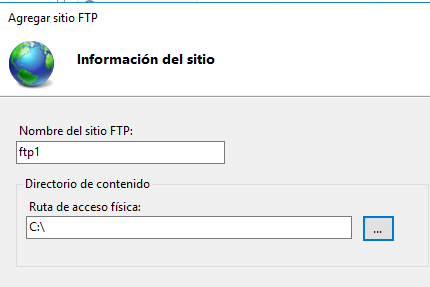
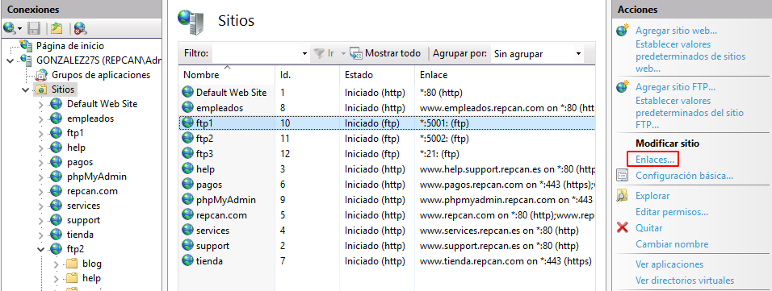
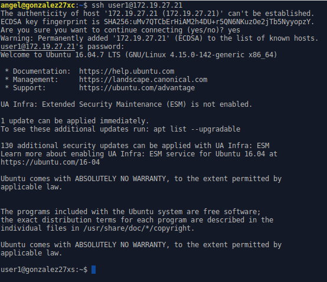

# FTP Windows y Linux

En esta práctica aprenderemos a instalar y configurar un servidor FTP tanto en un sistema operativo Windows Server como en un sistema operativo GNU-Linux -> Ubuntu

## 1. Windows

### 1.1. Instalación del servicio FTP

Para comenzar con esta práctica, vamos a instalar el servicio FTP en Windows Server. Para ello, iniciamos la MV de Windows Server y vamos a `Administrador del servidor -> Administrar -> Agregar roles y características`:

Ahora seguiremos los siguientes pasos:

* **Tipo de instalación:** Basada en roles o características.

  

* **Servidor de destino:** Seleccionamos nuestro servidor.

  

* **Roles de servidor:** Seleccionamos `Servidor web (IIS) -> Servidor FTP -> TODO`.

  

* **Progreso de la instalación:** Instalamos y esperamos.

  

Con estos sencillos pasos ya tendremos el servicio FTP instalado. Por supuesto, cualquier otro paso no mencionado se dejará por defecto.

### 1.2. Creación de sitios FTP

Ahora vamos a crear tres sitios web. Explicaremos que queremos de cada uno y los pasos a seguir.

Para crear un sitio web FTP debemos de ir a `Administrador del servidor -> Herramientas -> IIS`:

Y en `Servidor -> Sitios`, le damos clic en `Agregar sitio FTP`:

Una vez explicado, cada vez que mencionemos el paso de crear un nuevo sitio web, haremos estos dos sencillos pasos.

En todos los sitios web se debe poder acceder a través de las IPs del servidor y, en algún caso, de un nombre DNS ftp.tudominio.ext. Para ello, vamos a `Administrador del servidor -> Herramientas -> DNS`:

Y en `Servidor -> ZBD -> tudominio.ext` creamos un nuevo alias llamado `ftp`:

#### Sitio FTP 1

Para el primer sitio web, queremos lo siguiente:

* Debe estar asociado a la unidad `C:` completa.

* No debe permitir accesos anónimos.

* Sin uso de SSL.

* Sólo el usuario Administrador podrá acceder al sitio.

* Modos lectura y escritura.

##### Crear sitio

Vamos a IIS y le damos a crear sitio FTP. Le pondremos un nombre y la ruta de acceso será la unidad `C:\`:

Asignamos todas las IPs con el puerto 21 y deshabilitamos SSL:

Seleccionamos la autenticación básica y autorizamos solamente el acceso al usuario `Administrador` con permisos de lectura y escritura:

##### Acceso desde el explorador de archivos

Abrimos el explorador de archivos y en el cuadro de ruta escribimos `ftp://IP.DEL.NUESTRO.SERVER/`:

Nos pedirá iniciar sesión para acceder. Pondremos el usuario `Administrador` y la contraseña del mismo:

Comprobamos que tenemos acceso:

##### Acceso desde Internet Explorer

Abrimos Internet Explorer y en la URL escribimos `ftp://IP.DEL.NUESTRO.SERVER/`:

Nos pedirá iniciar sesión para acceder. Pondremos el usuario `Administrador` y la contraseña del mismo:

Comprobamos que tenemos acceso:

##### Acceso con otro usuario del dominio

Abrimos el explorador de archivos y en el cuadro de ruta escribimos `ftp://IP.DEL.NUESTRO.SERVER/`. Accedemos con el usuario `jorgarmor`:

Debería denegar el acceso ya que sólo el usuario `Administrador` tiene permiso a acceder al sitio:

##### Acceso desde el cliente

Abrimos una MV con Windows 10 que esté registrado en nuestro dominio y accedemos desde el explorador de archivos. Accedemos con el usuario `Administrador`:

Y comprobamos que podemos acceder correctamente desde el cliente:

Hacemos lo mismo desde el Internet Explorer:

Comprobamos que también tenemos acceso:

##### CLIENTE. Descargar e instalar WinSCP

Ahora vamos a instalar `WinSCP`. Es una herramienta que nos ortoga mayor facilidad al acceder vía FTP y otros servicios.

Podemos descargarlo mediante el [siguiente enlace](https://winscp.net/eng/download.php) o mediante [descarga directa](https://winscp.net/download/WinSCP-5.19.5-Setup.exe):

Una vez descargada lo ejecutamos y seguimos los siguientes pasos de instalación:

* **Acuerdo de licencia:** La leemos y seguimos aceptando los términos.

  

* **Tipo de instalación:** Instalación típica.

  

* **Cofiguración inicial:** Elegimos el que queramos.

  

* **Instalación:** Instalamos y esperamos.

  

Con estos pasos instalamos WinSCP de forma sencilla.

##### Comprobación de acceso al sitio web con WinSCP

Ejecutamos WinSCP y abrimos un nuevo sitio poniendo el protocolo FTP, sin cifrado, IP del servidor, puerto, usuario y contraseña:

Accedemos al servidor con el usuario `Administrador` y comprobamos que podemos ver la unidad `C:` del servidor correctamente:

##### Comprobación con DNS

En este caso (que es opcional), usando el registro DNS mencionado anteriormente, accedemos al sitio FTP usando el registro DNS, es decir, abrimos el navegador y escribimos `ftp://ftp.tudominio.ext/`, hacemos el inicio de sesión y comprobamos:

##### Sitio FTP 2

Para el segundo sitio web, queremos lo siguiente:

* Debe estar asociado al directorio `C:\inetpub\wwwroot`.

* No debe permitir accesos anónimos.

* Permitir SSL.

* Se permitirá acceso a todos los usuarios de Active Directory.

* Modos lectura y escritura.

##### Crear sitio

Vamos a IIS y le damos a crear sitio FTP. Le pondremos un nombre y la ruta de acceso será el directorio `C:\inetpub\wwwroot`:

Asignamos todas las IPs con el puerto 21 y permitimos SSL. Seleccionamos un certificado SSL que ya tengamos creado:

Seleccionamos la autenticación básica y autorizamos a todos los usuarios con permisos de lectura y escritura. Con todos nos referimos a los usuarios de Active Directory:

##### Acceso desde el explorador de archivos

Abrimos el explorador de archivos y en el cuadro de ruta escribimos `ftp://IP.DEL.NUESTRO.SERVER/` o `ftp://ftp.tudominio.ext/`. Nos pedirá iniciar sesión para acceder. Podemos poner cualquier usuario del AD, así que pondremos el usuario `ayogonlop` y la contraseña del mismo:

Comprobamos que tenemos acceso:

##### Acceso desde Internet Explorer

Abrimos Internet Explorer y en la URL escribimos `ftp://IP.DEL.NUESTRO.SERVER/` o `ftp://ftp.tudominio.ext/`. Nos pedirá iniciar sesión para acceder. Pondremos ahora el usuario `jorgarmor` y la contraseña del mismo:

Comprobamos que tenemos acceso:

##### Acceso con usuario fuera de Active Directory

Abrimos Internet Explorer y en el cuadro de ruta escribimos `ftp://IP.DEL.NUESTRO.SERVER/` o `ftp://ftp.tudominio.ext/`. Accedemos con el usuario local `angeldavid`:

Debería denegar el acceso ya que sólo los usuarios de Active Directory tienen permiso a acceder al sitio:

##### Acceso desde el cliente

Vamos a la MV con Windows 10 y accedemos desde el explorador de archivos. Accedemos con el usuario `alejandro`:

Y comprobamos que podemos acceder correctamente desde el cliente:

Hacemos lo mismo desde el Internet Explorer pero con el usuario `alexander`:

Y comprobamos que también tenemos acceso:

##### Comprobación de acceso al sitio web con WinSCP

Ahora abrimos WinSCP y abrimos una nueva sesión poniendo el protocolo FTP, con cifrado SSL explícito, IP del servidor, puerto, usuario de Active Directory y contraseña:

Nos preguntará si estamos seguros de acceder al servidor. Aceptamos y accedemos:

Comprobamos que podemos ver el directorio `C:\inetpub\wwwroot\` del servidor correctamente:

#### Sitio FTP 3

Para el tercer sitio web, queremos lo siguiente:

* Debe estar asociado a la carpeta que queramos (siempre que no sea importante).

* Debe permitir accesos anónimos.

* Sin SSL.

* Modo lectura.

##### Crear sitio

Vamos a IIS y le damos a crear sitio FTP. Le pondremos un nombre y la ruta de acceso será el directorio que queramos:

Asignamos todas las IPs con el puerto 21 y deshabilitamos SSL:

Seleccionamos la autenticación anónima y permitimos el acceso a los usuarios anónimos con permisos de lectura:

> ***A partir de aquí, no se ha podido avanzar más con el sitio web 3 debido a problemas con los usuarios anónimos.***

### 1.3. Habilitar varios sitios FTP simultáneamente

Anteriormente, debíamos detener un sitio web para activar otro. En este paso haremos que podamos activar y acceder a los tres sitios simultáneamente (dos, ya que el sitio web 3 no está funcional).

Para ello, vamos a `Firewall de Windows con seguridad avanzada` y en `Reglas de entrada` creamos una nueva regla:

Seguiremos los siguientes pasos:

* **Tipo de regla:** Puerto.

  

* **Protocolo y puerto:** Protocolo TCP y puertos locales del 5000 al 5010.

  

* **Acción:** Permitir la conexión.

  

* **Perfil:** Aplicar regla a todo.

  

* **Nombre:** Ponemos un nombre para identificar la regla.

  

Comprobamos que se ha creado la regla correctamente:

Ahora vamos a `IIS -> Servidor -> Compatibilidad con el firewall de FTP` y ponemos en el intervalo de puerto del canal de datos pondremos el rango de puertos que establecimos en la regla del firewall:

Ahora vamos a `Sitios`. Seleccionamos un sitio FTP y le damos a `Enlaces`:

Modificamos el puerto del sitio y le ponemos un puerto del 5000 al 5010:

Hacemos lo mismo con los otros 2 sitios FTP:

Vamos al equipo cliente y abrimos WinSCP. Abrimos dos sesiones con los dos sitios web FTP funcionales. Para cada sitio pondremos el puerto que le corresponde:

Sitio Web 1:

Sitio Web 2:

Con esto ya hemos conseguido abrir varios sitios FTP simultáneamente.

---

## 2. Linux

### 2.1. Instalación del servicio SSH

Para empezar con Linux, necesitaremos instalar el servicio `SSH`. Para ello, iniciamos una MV de Linux (Xubuntu) y abrimos una terminal como usuario ***root*** con el comando `sudo su`.

Instalamos el servicio con el comando `apt install ssh`:

Esperamos a que se instale.

### 2.2. Crear usuarios

Una vez instalado, crearemos dos usuarios con distintos permisos:

|Usuario|Grupo|
|-------|-----|
|user1|users|
|user2|root|

Para ello, usaremos el siguiente comando:

~~~
useradd -g grupo -d /home/usuario -m -s /bin/bash/ usuario
~~~

Deberían quedar así:

Para que el usuario `user2` tenga privilegios de usuario root, editamos el fichero `/etc/sudoers` con el comando `nano` y escribimos la siguiente línea:

~~~
user2   ALL=(ALL:ALL) ALL
~~~

Debería quedar así:

Cerramos sesión y accedemos con el usuario `user1`. Comprobamos que no podemos eliminar ficheros protegidos ya que no tenemos permisos:

Cerramos sesión y accedemos con el usuario `user2`. Comprobamos que podemos instalar algún que otro paquete:

### 2.3. Comprobar SSH desde el cliente

Ahora iniciamos una MV de Linux (Xubuntu) cliente, abrimos una terminal y probamos el acceso remoto con el comando `ssh user1@IP.DEL.EQUIPO.SERVIDOR`. Ponemos la contraseña del usuario `user1` y comprobamos que tenemos acceso:

Hacemos lo mismo con el usuario `user2`. Usamos el comando `ssh user2@IP.DEL.EQUIPO.SERVIDOR`:

### 2.4. Ejecutar programa desde el cliente mediante SSH

Ahora vamos a probar a ejecutar un programa del servidor (firefox) desde el cliente. Para ello, ejecutamos el comando `ssh usuario@IP.DEL.EQUIPO.SERVIDOR firefox`:

Como se puede ver, nos sale un error mencionando que no se muestra una pantalla específica y no podemos ejecutar el programa.

### 2.5. Instalación del paquete proftpd

Ahora vamos a instalar el paquete `proftpd`. Para ello, vamos a la MV de Linux Server y ejecutamos el comando `apt install proftpd`:

Nos preguntará si se ejecutará desde inetd o independientemente. Nosotros seleccionamos la segunda opción:

Una vez instalado, comprobamos la versión con el comando `proftpd --version`:

Finalmente comprobamos si está activado con el comando `systemctl status proftpd`:

### 2.6. Configurar proftpd

Para configurar proftpd, necesitaremos modificar el fichero de configuración `/etc/proftpd/proftpd.conf` con el comando `nano` y modificaremos lo siguiente:

### 2.7. Conectar al servicio FTP (servidor/cliente)

#### Desde el servidor (Local)

Para probar el acceso FTP de manera local, simplemente ejecutaremos el comando `ftp 127.0.0.1` y pondremos el usuario y contraseña:

* **user1:**

  

* **user2:**

  

#### Desde el cliente (Remoto)

Para probar el acceso FTP de manera remota, ejecutamos el comando `ftp IP.DEL.EQUIPO.SERVIDOR` desde el cliente y pondremos el usuario y contraseña:

* **user1:**

  

* **user2:**

  

### 2.8. Comprobación de operaciones FTP desde el cliente

Ahora vamos a probar operaciones FTP desde el cliente. En el servidor crearemos los ficheros `server-us1.txt` (desde el usuario `user1`) y `server-us2.txt` (desde el usuario `user2`). En el cliente crearemos los ficheros `cliente-us1.txt` y `cliente-us2.txt`.

#### user1

Accedemos al servidor mediante FTP:

Comprobamos la lista de directorios con el comando `dir`:

Obtenemos el fichero `server-us1.txt` del servidor con el comando `get`:

Comprobamos en el cliente que tenemos el fichero:

Subimos el fichero del cliente `cliente-us1.txt` para tenerlo en el servidor con el comando `put`:

Comprobamos desde el servidor que hemos obtenido el fichero:

#### user2

Accedemos al servidor mediante FTP y comprobamos la lista de directorios con el comando `dir`:

Subimos el fichero del cliente `cliente-us2.txt` para tenerlo en el servidor con el comando `put`:

Comprobamos desde el servidor que se ha subido el fichero correctamente:

Y obtenemos el fichero `server-us2.txt` del servidor con el comando `get`. Comprobamos con el comando `dir`.

> ***He perdido la última imagen.***
