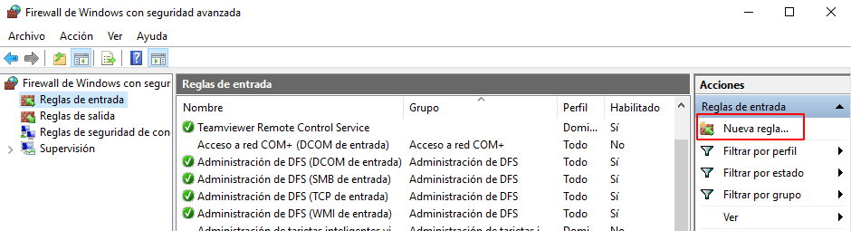

# FTP Windows y Linux

## 1. Windows

### 1.1. Instalación del servicio FTP

### 1.2. Creación de sitios FTP

#### Sitio FTP 1

#### Sitio FTP 2

#### Sitio FTP 3

### 1.3. Habilitar varios sitios FTP simultáneamente

## 2. Linux

### 2.1. Instalación del servicio SSH

### 2.2. Crear usuarios

### 2.3. Comprobar SSH desde el cliente

### 2.4. Ejecutar programa desde el cliente mediante SSH

### 2.5. Instalación del paquete proftpd

### 2.6. Configurar proftpd

### 2.7. Conectar al servicio FTP (servidor/cliente)

### 2.8. Comprobación de operaciones FTP desde el cliente

