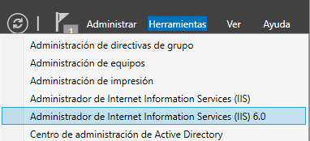
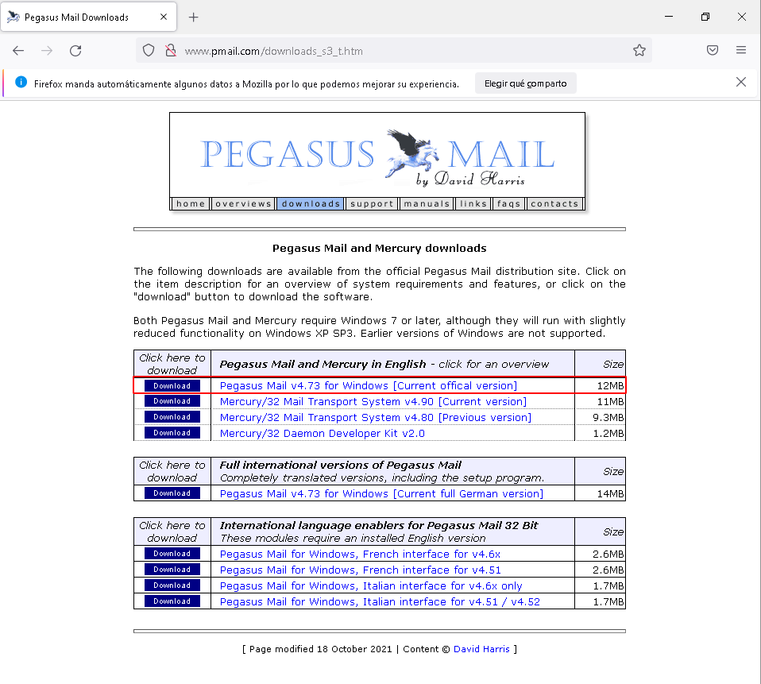
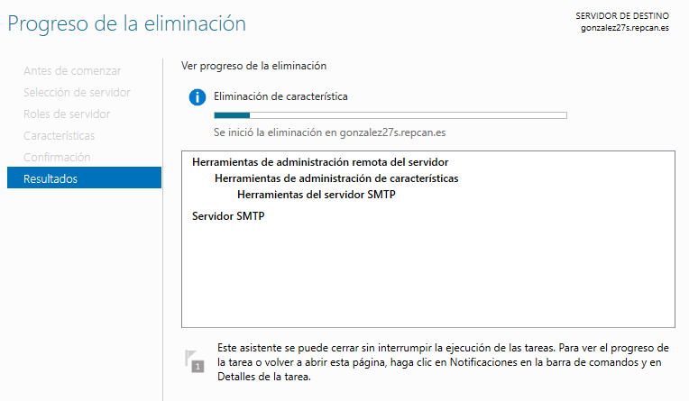
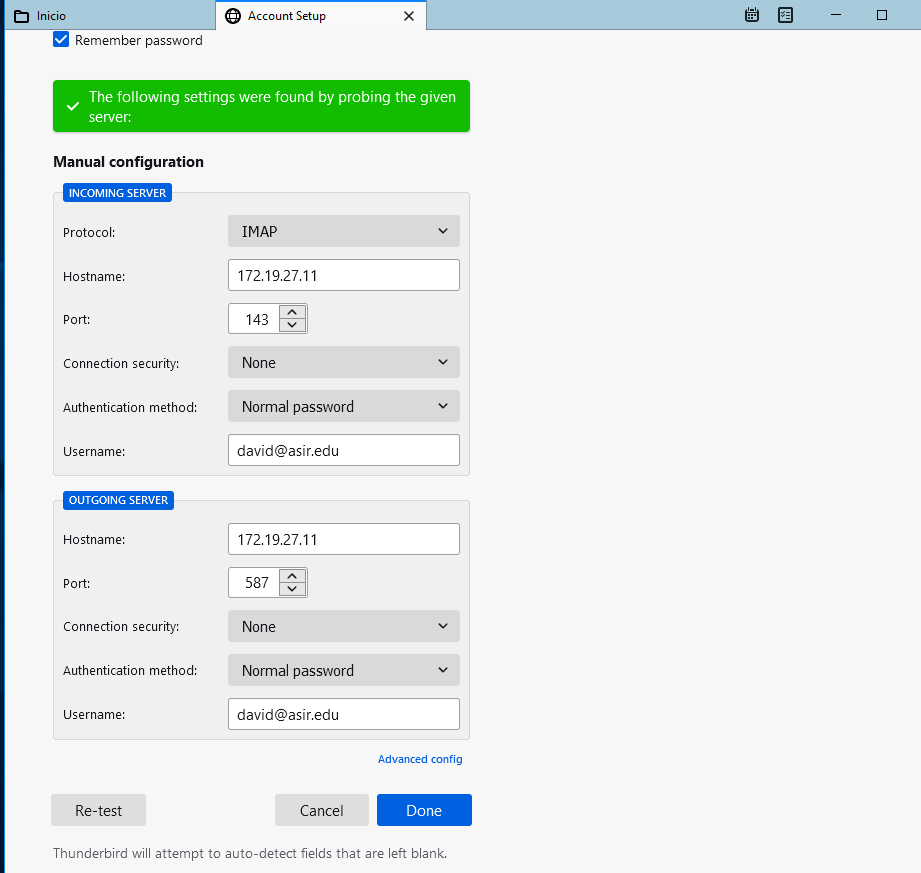
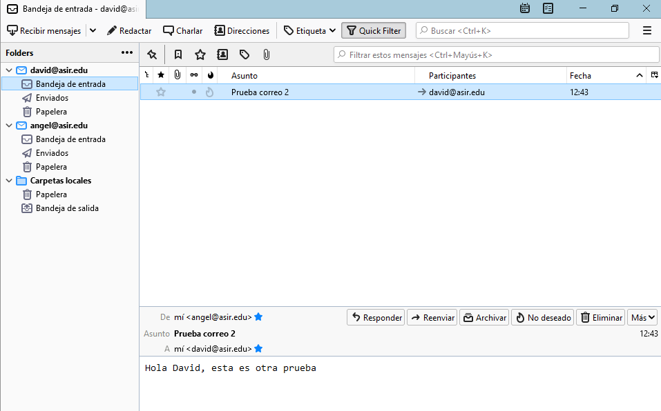

# Instalación y Configuración de Servicios de Correo Electrónico en Windows 2016 Server

En esta práctica aprenderemos a instalar y configurar un servidor SMTP en un sistema operativo Windows Server.

---

## Índice:

* [1. Servicio SMTP](#1)

  * [1.1. Instalar servicio SMTP](#1.1)

  * [1.2. Configuración del servicio SMTP (anónima)](#1.2)

  * [1.3. Comprobación desde el cliente](#1.3)

  * [1.4. Configuración del servicio SMTP (autenticación básica)](#1.4)

  * [1.5. Comprobación desde el cliente](#1.5)

* [2. hMailServer](#2)

  * [2.1. Desinstalar servicio SMTP](#2.1)

  * [2.2. Descargar e instalar hMailServer](#2.2)

  * [2.3. Configuración](#2.3)

  * [2.4. Comprobación desde el cliente](#2.4)

---

## 1. Servicio SMTP 

### 1.1. Instalar servicio SMTP 

Para empezar con esta práctica, vamos al `Administrador del Servidor -> Administrar -> Agregar roles y características`:

Seleccionamos la `Instalación basada en características o roles`:

Seleccionamos nuestro servidor:

Saltamos los roles y seleccionamos la característica `Servidor SMTP`:

Confirmamos e instalamos:

Finalmente esperamos a que finalize la instalación:

Con esto ya tendremos el servidor SMTP instalado, ahora falta configurarlo...

### 1.2. Configuración del servicio SMTP (anónima) 

Ahora vamos a configurar el servicio SMTP. Para ello, vamos a `Administrador del Servidor -> Herramientas -> IIS 6.0`:

Vamos a `Servidor -> SMTP Virtual...`, le damos clic derecho y seleccionamos `Propiedades`:

En `General`, configuraremos lo siguiente:

* **Dirección IP**: Todas las no asignadas

* **Limitar numero de conexiones a**: 50

* **Formato de registro activo**: Propiedades

* **Formato de registro activo -> Propiedades**: Programación diaria en el directorio `C:\Windows\System32\LogFiles`

En `Acceso` vamos a `Control de acceso -> Autenticación`:

Seleccionamos el acceso anónimo:

En `Acceso` vamos a `Control de conexión -> Conexión` y denegamos la conexión a un equipo con una IP determinada:

Luego le echamos un vistazo al resto de opciones:

**Mensajes**:

**Entrega**:

Comprobamos que tenemos un dominio AD determinado creado en el servicio SMTP:

Lo que haremos es crear un alias en el dominio anterior para disponer de cuentas de otro dominio:

Comprobamos que se ha creado correctamente:

Y finalmente comprobamos que se han creado las carpetas de correos en `C:\inetpub\mailroot`:

### 1.3. Comprobación desde el cliente 

Ahora vamos a nuestra máquina cliente y comprobamos que tenemos acceso al dominio abriendo una terminal y escribiendo el comando `nslookup accounts.tu.dominio`:

Podemos ver que tenemos acceso.

Ahora abrimos el navegador y vamos a la página oficial de [Pegasus Mail](http://www.pmail.com/downloads_s3_t.htm) y descargamos el instalador mediante el [siguiente enlace](http://download-us.pmail.com/w32-473.exe):

Una vez descargado vamos a instalarlo mediante los siguientes pasos:

* **Bienvenida**: Explica los que vas a descargar.

  

* **Detalles de instalación**: Ponemos la ruta en `C:\PMAIL`.

  

* **Otras opciones de instalación**: Seleccionamos todo.

  

Una vez realizados los pasos, se instalará:

Ejecutamos el programa y vamos a `Tools -> Internet Options`:

En `General`, ponemos nuestro correo electrónico:

En SMTP agregaremos un servidor de envío:

Ponemos nuestra dirección IP:

Y ya lo tendremos añadido:

Ahora enviaremos un correo de prueba:

Para enviar el correo, le damos al icono del planeta con la flecha para arriba:

En mi caso, este proceso me ha dado error.

### 1.4. Configuración del servicio SMTP (autenticación básica) 

En este apartado no se ha podido avanzar.

### 1.5. Comprobación desde el cliente 

En este apartado no se ha podido avanzar.

---

## 2. hMailServer 

### 2.1. Desinstalar servicio SMTP 

Para utilizar hMailServer, necesitamos desinstalar el servicio SMTP. Para ello, vamos a `Administrador del Servidor -> Administrar -> Quitar roles y funciones`:

Seleccionamos nuestro servidor:

Seleccionamos la característica `Servidor SMTP`:

Comprobamos que ya no está marcado:

Finalizamos y eliminamos la característica:

### 2.2. Descargar e instalar hMailServer 

Ahora vamos a descargar hMailServer. Para ello, vamos a la página oficial de [hMailServer](https://www.hmailserver.com/download) y descargamos el instalador mediante [este enlace](https://www.hmailserver.com/download_getfile/?performdownload=1&downloadid=262):

Una vez descargado lo instalamos. Para ello, seguiremos los siguientes pasos:

* **Bienvenida**: Te explica lo que vas a instalar. Seguimos.

  

* **Licencia**: La leemos y aceptamos.

  

* **Destino**: Ponemos la ruta por defecto.

  

* **Componentes**: Seleccionamos todo.

  

* **Seleccion de tipo de base de datos**: Built-in

  

* **Carpeta del menú inicio**: Lo dejamos por defecto.

  

* **Seguridad de hMailServer**: Necesitamos poner una contraseña para el uso como administrador.

  

Una vez realizados los pasos, instalamos:

Nos saldrá esta advertencia de que el programa requiere de `.NET Framework 2.0` y nos preguntará si queremos instalarlo, como estamos en el servidor debemos instalarlo de otra manera:

Ya que al darle a instalarlo nos saldrá un error:

Para instalar `.NET Framework 2.0` vamos a `Administrador del Servidor -> Administrar -> Agregar roles y características`:

Seleccionamos la característica `Características de .NET Framework 3.5 -> .NET Framework 3.5 (incluye .NET 2.0 y 3.0)`:

Instalamos y volvemos a la instalación de hMailServer. Realizamos los mismos pasos anteriores y ya se debería instalar correctamente:

### 2.3. Configuración 

Ahora vamos a ejecutar el programa. Nos dará un equipo al que conectarse y que pongamos una contraseña:

Una vez dentro creamos los dominios `asir.edu` y `srd.edu`:

Deberían quedar así:

Vamos a `Utilities -> Backup` y ponemos una ruta para guardar las backups:

Comprobamos en la ruta que se guardan las backups:

Vamos a `Utilities -> Diagnostics`, seleccionamos los domimios con el servidor mail del DNS al que hace el diagnóstico y le damos a `Start`. Luego lo guardamos en `Save`:

Vamos a `DNS` y creamos los dominios `asir.edu` y `srd.edu` con el servidor local y el intercambiador de correo:

Ahora crearemos dos usuarios en cada dominio, para ello, vamos a `Dominio -> Accounts` y los creamos dando clic en `Add`:

Ponemos nombre y contraseña:

Y hacemos lo mismo con los demás. Deberían quedar así:

Vamos ahora a `Settings -> Protocols -> SMTP` y ponemos nuestro servidor local:

Luego vamos a `Utilities -> MX-query` y ponemos la dirección e-mail y nos debe resolver la IP de nuestro servidor:

En `Settings -> Loggin` marcamos las siguientes casillas:

En `Settings -> Advanced -> IP Ranges` le damos clic en `Add`:

Le ponemos el nombre y el rango de IP:

Con esto ya tenemos configurado hMailServer.

### 2.4. Comprobación desde el cliente 

Instalamos ***Mozilla Thunderbird*** y agregamos un usuario local. Ponemos, usuario, correo y contraseña y pondremos la siguiente configuración manual:

Nos advertirá de que el servidor no usa encriptación, pero es nuestro servidor, por lo que aceptamos los riesgos:

Probamos a realizar un mensaje de correo al otro usuario del dominio hMailServer:

Agregamos el segundo usuario:

Comprobamos que hemos recibido el correo que hicimos con el usuario "david":

Y escribiremos otro correo para comprobar lo mismo:

Entramos con el usuario "david" y comprobamos que hemos recibido el correo del usuario "angel"

Ahora creamos una `Lista de distribución` con el nombre `empleados`:

Y hacemos miembros a los usuarios anteriores:

De aquí en adelante no he podido avanzar...
