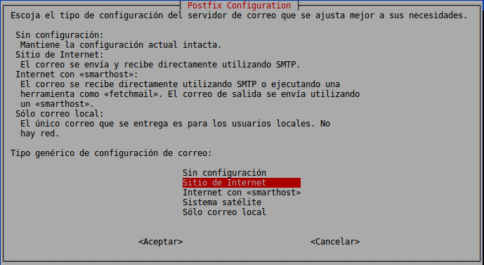
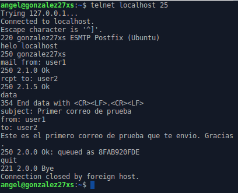

# Instalación y Configuración de Servidor de Correo Electrónico en Linux

En esta práctica aprenderemos a instalar y configurar un servidor SMTP en un sistema operativo Linux Server.

---

## Índice:

* [1. Servicio SMTP](#1)

  * [1.1. Instalar servicio SMTP](#1.1)

  * [1.2. Comprobación de puertos](#1.2)

  * [1.3. Comprobación de envío de correos](#1.3)

  * [1.4. Instalación de cliente de correo](#1.4)

  * [1.5. Configuración del cliente de correo](#1.5)

  * [1.6. Comprobación de envío de correos desde el cliente](#1.6)

* [2. Servicio IMAP](#2)

  * [2.1. Instalar servicio IMAP](#2.1)

  * [2.2. Comprobación de puertos](#2.2)

  * [2.3. Instalar programa de correo SquirrerMail](#2.3)

  * [2.4. Configuración de SquirrerMail](#2.4)

  * [2.5. Comprobación desde el servidor](#2.5)

  * [2.6. Comprobación desde el cliente](#2.6)

* [3. Servicio POP3](#3)

  * [3.1. Instalar servicio POP3](#3.1)

  * [3.2. Comprobación de puertos](#3.2)

  * [3.3. Configurar MUA](#3.3)

  * [3.4. Comprobación de envío de correos desde el cliente](#3.4)

---

## 1. Servicio SMTP 

### 1.1. Instalar servicio SMTP 

Para empezar con esta práctica, vanos a instalar un MTA que funcione como servidor SMTP, por lo que usaremos `postfix`. Para ello, abrimos nuestra MV de Linux Server e instalamos el servidor con el comando `sudo apt install postfix`:

Al instalar el servidor nos preguntará que tipo de configuración de correo queremos seleccionar, por lo que elegimos la opción `Sitio de Internet`:

Nos pedirá el nombre del dominio que usaremos para las direcciones de correo. Nosotros pondremos `miempresa.com` o similar:

Una vez instalado el servicio debemos de iniciarlo. Para ello, ejecutamos el comando `/etc/init.d/postfix start`:

Con esto ya tenemos el servicio SMTP instalado y puesto en marcha.

### 1.2. Comprobación de puertos 

Ahora comprobamos los puertos que están a la escucha con el comando `sudo netstat -utap`:

Debemos ver que el puerto SMTP está activo.

### 1.3. Comprobación de envío de correos 

Ahora vamos a crear un correo para probar el funcionamiento del mismo. Para ello, ejecutamos el comando `telnet localhost 25` y escribiremos lo siguiente:

~~~
helo localhost

mail from: <userA>

rcpt to: <userB>

data

subject: <asunto>
from: <userA>
to: <userB>
<Mensaje>
.

exit
~~~

Con esto hemos enviado un correo del usuario `userA` (user1) a `userB` (user2).

Ahora accedemos como usuario `userB` y ejecutamos el comando `cat /var/spool/mail/userB` para revisar que tenemos un correo. Confirmamos que es el que hicimos ahora mismo:

### 1.4. Instalación de cliente de correo 

Ahora vamos a instalar un cliente de correo `Evolution` para gestionar a ambos usuarios desde una MV Linux cliente. Para ello, usaremos el comando `sudo apt install evolution`:

### 1.5. Configuración del cliente de correo 

Una vez instalado, debemos agregar dos nuevas entradas en el fichero `/etc/hosts`. Para ello, usaremos el comando `sudo nano /etc/hosts` y añadimos las siguientes líneas:

~~~
IP-DE-NUESTRO-SERVER    smtp.miempresa.com
IP-DE-NUESTRO-SERVER    pop.miempresa.com
~~~

Debería quedar algo así:

Ejecutamos Evolution y realizaremos los siguientes pasos:

* **Identidad:** Ponemos nombre de `userA` y el correo `userA@miempresa.com`:

  

* **Recepción de correo:** Servidor POP `pop.miempresa.com`, puerto 110 y usuario `userA`:

  

* **Envío de correo:** Servidor SMTP `smtp.miempresa.com` y puerto 25:

  

* **Resumen:** Revisamos y finalizamos:

  

Hacemos lo mismo pero con `userB`:

### 1.6. Comprobación de envío de correos desde el cliente 

> **AVISO:** Como se podrá ver en la siguiente captura, hay un error de desconexión de red, pero la red de la MV funciona correctamente, por lo que no se ha podido avanzar mucho con este tema.

Ahora nos saldrá esta interfaz y vamos a crear un nuevo correo de `userA` para `userB`:

Hacemos el correo y lo enviamos. Debería verse en la carpeta `Correo enviado`:

> Como se puede apreciar, el correo está en el correo de `Bandeja de salida` ya que el programa no funciona correctamente, por lo que el correo no llega al usuario receptor.

---

## 2. Servicio IMAP 

### 2.1. Instalar servicio IMAP 

Ahora vamos a instalar el servicio IMAP. Para ello, usaremos el comando `sudo apt install dovecot-imapd`:

### 2.2. Comprobación de puertos 

Comprobamos que el servicio y puerto del servicio IMAP esté activo con el comando `sudo netstat -utap`:

### 2.3. Instalar programa de correo SquirrerMail 

Ahora instalaremos la aplicación de correo web SquirrerMail. Para ello, usaremos el comando `sudo apt install squirrermail`:

### 2.4. Configuración de SquirrerMail 

Ahora necesitamos hacer una serie de comandos:

* `sudo cp -r /etc/squirrermail/apache.conf /etc/apache2/sites-available` - Copiamos el fichero de configuración apache de squirrermail y lo ponemos en el directorio de los sitios no disponibles de apache.

* `sudo ln -s /etc/apache2/sites-available/apache.conf /etc/apache2/sites-enabled/` - Hace un enlace simbólico al fichero copiado anteriormente para situarlo en el directorio de sitios disponibles de apache.

Finalmente agregamos a los usuaios `userA` y `userB` al grupo `mail`. Para ello, ejecutamos el comando `sudo adduser <user> mail`:

> Sin este paso, no tenemos permisos de acceso al MAILBOX.

### 2.5. Comprobación desde el servidor 

Desde el servidor, abrimos un navegador y ponemos en la URL `localhost/squirrermail` y comprobamos que nos aparece una página de logueo de SquirrerMail:

### 2.6. Comprobación desde el cliente 

Desde el cliente, abrimos un navegador y ponemos en la URL `IP-DE-NUESTRO-SERVER/squirrermail` y comprobamos que nos aparece la misma página de logueo de SquirrerMail. Luego, nos logueamos con el usuario `user1`:

Accedemos y creamos un correo nuevo para `user2`:

Preparamos el correo y lo enviamos:

Comprobamos que en `INBOX Sent` debe estar el correo que hemos enviado:

Finalmente comprobamos de nuevo el correo con el comando `cat /var/spool/mail/userB`. Debería estar el correo nuevo:

Hacemos lo mismo con el usuario `userB`...

---

## 3. Servicio POP3 

### 3.1. Instalar servicio POP3 

Ahora vamos a instalar el servicio POP3. Para ello, usaremos el comando `sudo apt install dovecot-pop3d`:

### 3.2. Comprobación de puertos 

Comprobamos que el servicio y puerto del servicio POP3 esté activo con el comando `sudo netstat -utap`:

### 3.3. Configurar MUA 

Abrimos Evolution y vamos a `Editar -> Preferencias`. Seleccionamos el usuario y le damos a `Editar`:

Establecemos el servidor POP:

> A partir de aquí me sigue apareciendo el mismo error que antes y uno mas; que el servidor POP no se reconoce ni lo localiza y que la red está desconectada en Evolution, por lo que no es posible avanzar a partir de aquí.

### 3.4. Comprobación de envío de correos desde el cliente 
