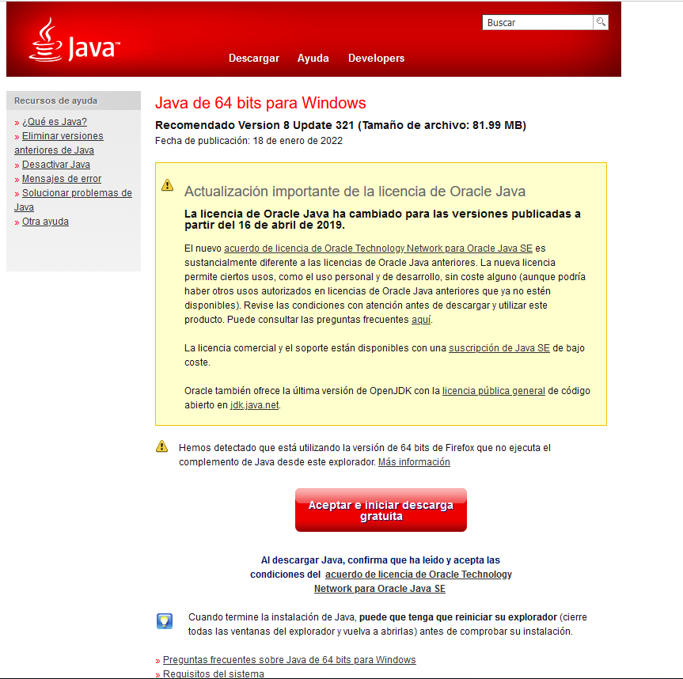
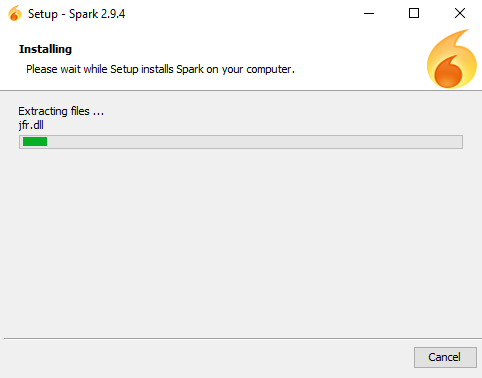
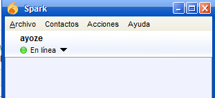

# Mensajería Instantánea - Windows
##### Trabajo elaborado por Ayoze Hernández y Ángel David González

En esta práctica aprenderemos a instalar y configurar un servidor de mensajería instantánea en Windows Server 2016.

---

## Índice:

* [1. Servidor OpenFire](#1)

  * [1.1. Instalación](#1.1)

  * [1.2. Configuración](#1.2)

* [2. Cliente Spark](#2)

  * [2.1. Instalación](#2.1)

  * [2.2. Acceso administrador](#2.2)

  * [2.3. Configuración](#2.3)

  * [2.4. Acceso cliente](#2.4)

  * [2.5. Realizar comunicación administrador - usuario](#2.5)

---

## 1. Servicio OpenFire 

### 1.1. Instalación 

Para empezar con esta práctica, vamos a [descargar](https://www.igniterealtime.org/downloadServlet?filename=openfire/openfire_4_7_0_x64.exe) e instalar el servidor OpenFire. Al instalarlo nos aparecerá el siguiente mensaje:

Esto quiere decir que necesitamos instalar Java en nuestro equipo, por lo que vamos a la [páginea web oficial](https://www.java.com/es/download/) y lo [descargamos](https://javadl.oracle.com/webapps/download/AutoDL?BundleId=245807_df5ad55fdd604472a86a45a217032c7d):

Instalamos:

Y una vez instalado Java, volvemos a instalar OpenFire. Seguiremos los siguientes pasos:

* Seleccionamos el idioma:

  

* Saltamos la bienvenida:

  

* Leemos y aceptamos la licencia:

  

* Ponemos ruta de instalación:

  

* Creamos carpeta en el menú inicio (opcional):

  

* Esperamos a la instalación:

Con esto ya tendremos OpenFire instalado.

### 1.2. Configuración 

Vamos al navegador e introducimos la URL `127.0.0.1:9090` y nos debería aparecer la siguiente página de configuración de OpenFire:

Seleccionamos el lenguaje en Español y configuramos el servidor con las siguientes propiedades:

Seleccionamos la opción `Base de datos interna`:

Vamos a **phpmyadmin** y creamos un usuario ligado a la base de datos que vamos a crear:

Creamos la base de datos y asignamos al usuario anterior todos los permisos a dicha BD:

Seleccionamos la configuración de perfil por defecto:

Ponemos cuenta de administrador:

Y con eso ya tenemos OpenFire instalado y configurado.

---

## 2. Cliente Spark 

### 2.1. Instalación 

Ahora procedemos a descargar Spark desde la [página web oficial](https://www.igniterealtime.org/downloads/#openfire) o mediante [descarga directa](https://www.igniterealtime.org/downloadServlet?filename=spark/spark_2_9_4-with-jre.exe). Una vez descargado, seguimos los siguientes pasos de instalación:

* Saltamos la bienvenida:

  

* Seleccionamos la ruta de instalación:

  

* Creamos carpeta en el menú inicio (opcional):

  

* Seleccionamos si queremos un acceso directo o no:

  

* Instalamos:

  

* Finalizamos y ejecutamos Spark

  

### 2.2. Acceso administrador 

Nos pedirá usuario, contraseña y dominio, introducimos los datos de administrador y accedemos:

Podemos ver que hemos accedido correctamente:

### 2.3. Configuración 

Vamos a crear una nueva cuenta, para ello, ponemos usuario, contraseña y dominio:

Una vez creado, lo agregamos a nuestros contactos:

Finalmente modificamos el fichero `C:\Windows\Sistem32\drivers\etc\hosts` y agregamos la siguiente línea:

~~~
IP.DELA.MV.CLIENTE    Cliente             ## Poner IP del cliente y su nombre de equipo.
~~~

Debería verse así:

### 2.4. Acceso cliente 

Instalamos Spark en una MV Cliente Windows e intentamos acceder con el usuario cliente:

Al parecer, no hemos podido acceder ya que aparece este error tanto en el cliente como en el servidor:

### 2.5. Realizar comunicación administrador - usuario 

No se puede adelantar más...
