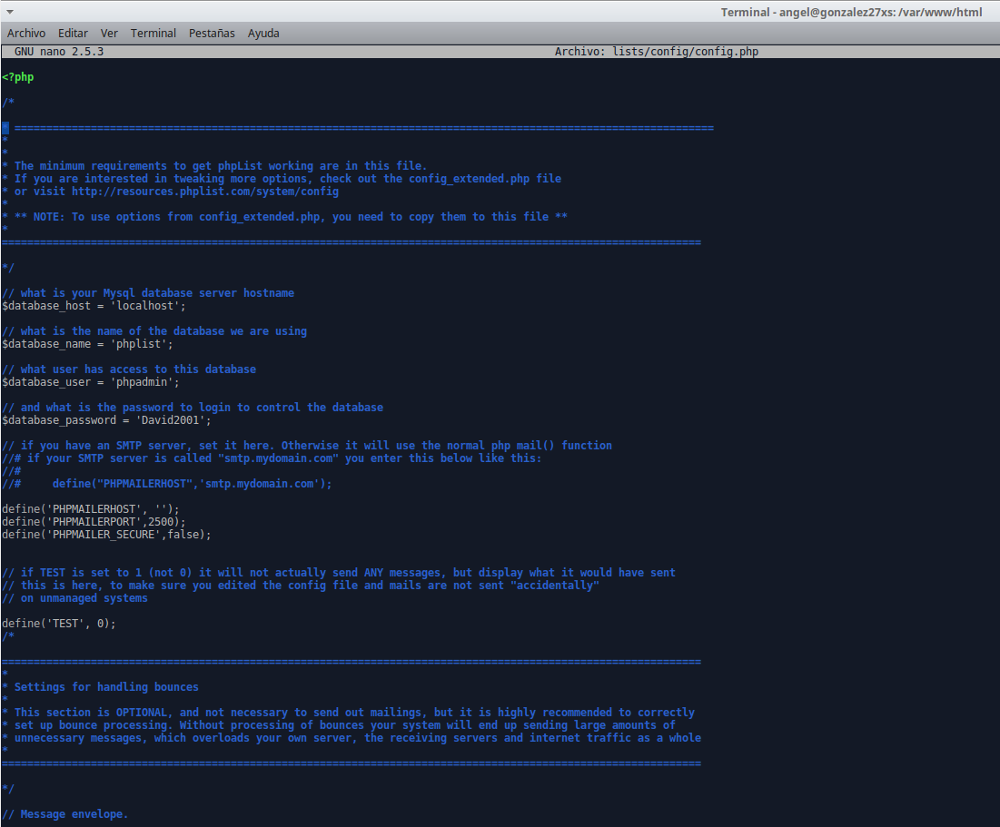
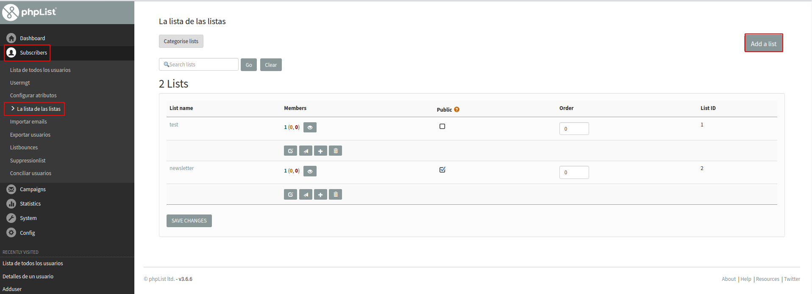
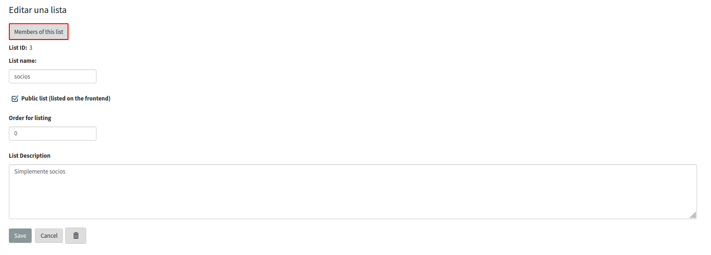
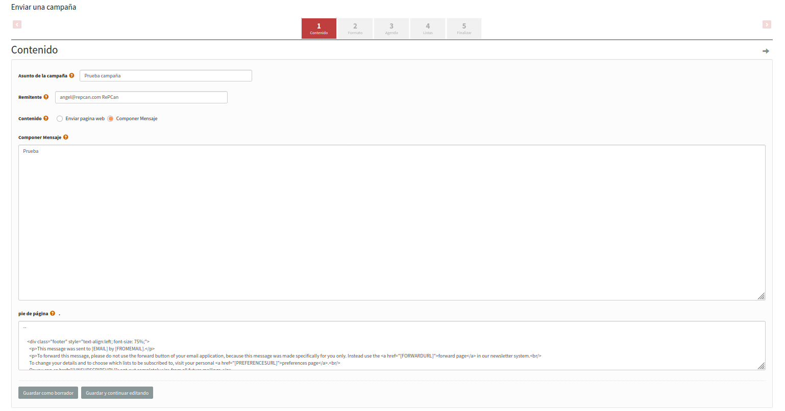

# Phplists

***Nombre:*** Angél David González Quintana y Ayoze Hernández Díaz
***Curso:*** 2º de Ciclo Superior de Administración de Sistemas Informáticos en Red.

### ÍNDICE

+ [Comprobaciones previas](#id1)
+ [Instalación de Phplist](#id2)
+ [Configuración de Phplist](#id3)
+ [Creación de usuarios](#id4)
+ [Páginas de inscripción](#id5)
+ [Iniciar una campaña](#id6)

#### ***Comprobaciones previas***. 
Para la practica necesitaremos los servicios y utilidades de:

* **Apache2**
* **Php**
* **PhpmyAdmin**

Comprobamos que tenemos los componentes instalados.

#### ***Instalación de Phplist***. 

Descargamos el paquete de **phplist**.

Ahora descomprimimos el paquete descargado en la ruta /var/www y se nos genera la carpeta **phplist-3.6.6**.

Vemos el contenido de este direcotorio y movemos la  carpeta **/var/www/phplist-3.6.6/public_html/lists** a **/var/www** como se muestra en las 2 siguientes imágenes.

Entramos en la carpeta y vemos que el contenido de esta está ahí.

Editamos el fichero ***config.php*** situado en **/var/www/lists/config/** y cambiamos los siguientes campos:

* **$database_name** = 'phplist'
* **$database_user** = 'phpadmin'
* **$database_password** = 'David2001'

#### ***Configuración de Phplist***. 

Accedemos a **localhost/list/admin** a través de un navegador. para configurar el servicio.

Introducimos los datos que nos solicitan como:

* Nombre.
* Nombre de la empresa u organización.
* Correo de contacto.
* Contraseña para poder entrar.

Continuamos y vemos que la base de datos se empieza a configurar.

Nos saldrá el siguiente panel indicando que puntos de la configuración han resultado exitosos y cuales todavía no han sido realizados.

#### ***Creación de usuarios***. 

Ahora accedemos a la página principal de administración y listamos todos los usuarios y suscriptores.

Vamos a añadir un usuario a mitad de la pantalla a la derecha.

Añadimos su información personal y creamos otro más de la misma manera.

Ahora podemos ver en el mismo apartado los suscriptores que tenemos

Ahora accedemos a **Subscribers>List of lists** y añadimos una lista.

Llamaremos a la lista socios y podemos añadirle tanto descripción como orden de importancia de la lista.

Ahora añadimos miembros a la lista como se muestra en las siguientes imágenes.

Aquí comprobamos los miembros pertenecientes a la lista.

Ahora en esta nueva pestaña que se ha abierto podemos importar suscriptores a la lista de socios

Para añadirlos debemos de escribir sus correos en la area de texto designada para ello, luego presionamos en el botón inferior que dice **Import emails**

Ahora vemos que tenemos como miembros de la lista a Antonio y a Hector.

En la página de **list of lists** o **La lista de las listas** vemos que la lista de socios ahora tiene el número 2 que representa a Hector y Antonio.

#### ***Páginas de inscripción***. 

Ahora nos dirigimos al panel lateral izquierdo y buscamos el apartado de configuración y entramos.

Nos aparecen varias secciones en esta página, siendo la primera una con configuración general como detalles sobre la cabecera, la introducción o el pié de página que se mostrarán en las páginas de inscripción, el idioma de la página o el título.

La siguiente sección nos permite editar que listas queremos que se muestren en la página de inscripción

La siguiente permite editar el mensaje que le llega a los usuarios una vez se suscriben.

Algo así vería alguien que se quiera suscribir

#### ***Iniciar una campaña***. 

Nos dirigimos al panel izquierdo, a la sección de **campañas** al apartado de **Gestionar las plantillas de las campañas** e importamos una plantilla del sistema.

Cogemos un valor por defecto.

Ahora podemos ver que ha sido añadida.

Ahora en el **listado de campañas** podemos inciar una campaña nosotros mismos.

Para crear una campaña debemos de configurar 5 pasos:

#### **Paso 1**

Debemos de rellenar los campos requerido:

  * Asunto
  * Remitente
  * Contenido

#### **Paso 2**

En el segundo paso podemos cambiar el formato del mensaje que les llegará a los usuarios y cambiar los siguientes aspectos:

* Titulo de la campaña.
* Formato (**HTML o texto**).
* Personas a las que se les enviará.

#### **Paso 3**

Aquí editaremos las fechas de retención de la campaña y cuando se detendrá el envió de esta campaña a los correos de los usuarios.

#### **Paso 4**

Aquí podemos añadir listas enteras de usuarios a los que enviarles la campaña

#### **Paso 5**

Aquí podemos añadir un correo al que notificar tanto el inicio de la campaña como el fin, se le puede añadir datos estadisticos de la campaña, como cuantas veces se hizo click en ella.

#### **Resultado**

Ahora en el listado de campañas activas se puede ver la campaña que acabamos de crear

