# Instalación y Configuración de un Servidor Streaming Multimedia - Windows 2016

---

## Índice

* [1. Instalación del servicio web (IIS)](#1)

* [2. Descarga e instalación de Unreal Media Server](#2)

* [3. Comprobación del vídeo de prueba](#3)

* [4. Creación de carpeta virtual](#4)

* [5. Comprobación](#5)

---

### 1. Instalación del servicio web (IIS) 

Para comenzar esta práctica, vamos a nuestra MV de Windows Server 2016 y accedemos a `Administrador del servidor -> Administrar -> Agregar roles y características`:

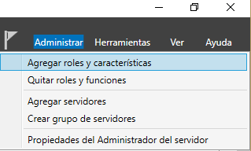

Ahora seguiremos los siguientes pasos:

* **Tipo de instalación:** Basada en roles.

  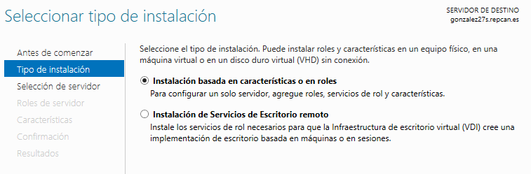

* **Servidor de destino:** Seleccionamos nuestro servidor.

  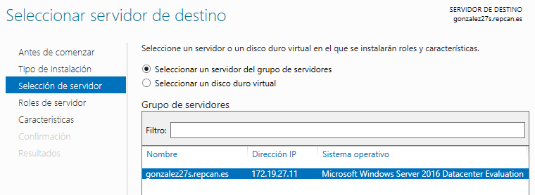

* **Roles del servidor:** Seleccionamos `Servidor web (IIS)`.

  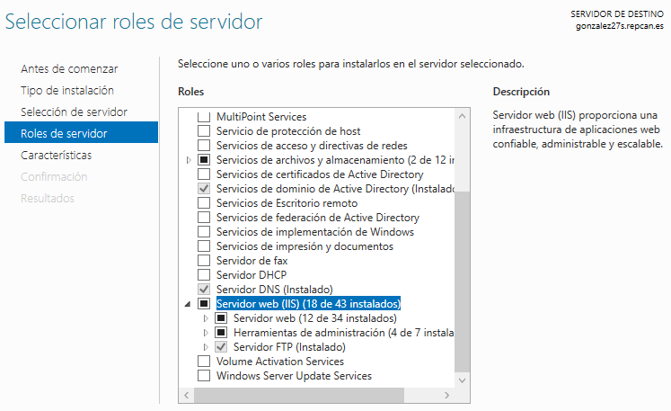

El resto de opciones los dejamos por defecto, seguimos e instalamos (en mi caso, ya lo tenía instalado por lo que no puedo mostrar más).

---

### 2. Descarga e instalación de Unreal Media Server 

Ahora vamos a la página web oficial de [Unreal Media Server](http://umediaserver.net/umediaserver/download.html) y descargamos el programa de 64 bits. [Descarga directa](http://umediaserver.net/bin/UMediaServer(x64).zip):

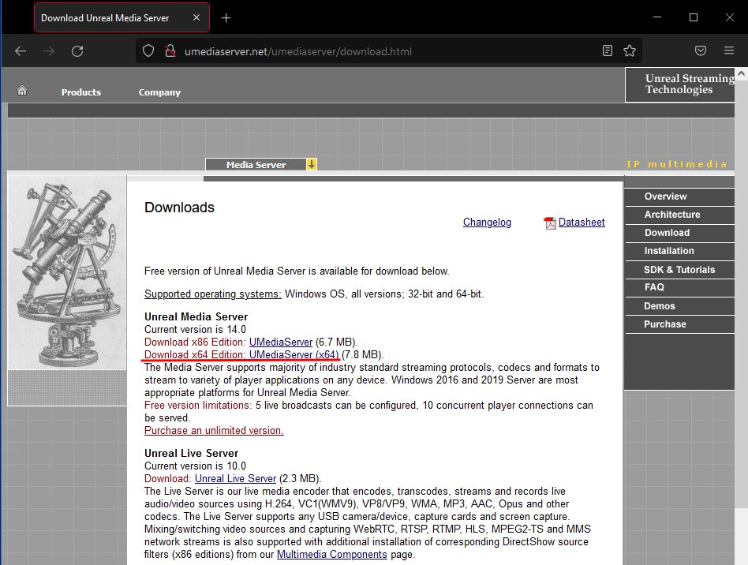

Una vez descargado lo descomprimimos:

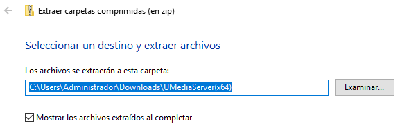

Y vemos que solo tiene el instalador, por lo que lo ejecutamos:

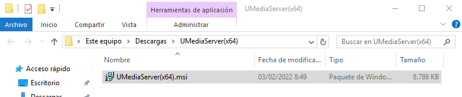

Nos preguntará si queremos ejecutar el archivo, por lo que aceptamos:

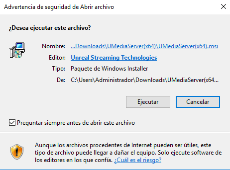

Y se abrirá una ventana del instalador dándonos la bienvenida, seguimos:

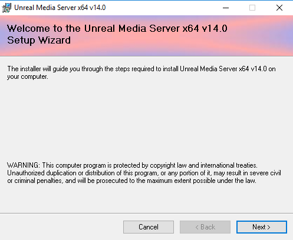

Leemos y aceptamos los términos de licencia:

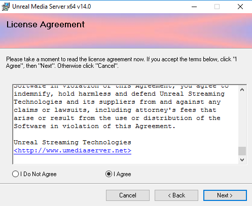

Seleccionamos la ruta de instalación:

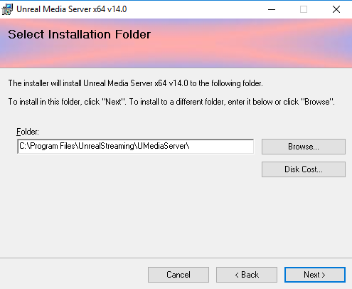

Y esperamos a que se instale:

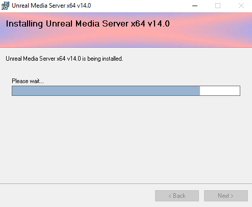

Una vez finalizado, ya tenemos Unreal Media Server instalado.

---

### 3. Comprobación del vídeo de prueba 

Ejecutamos el programa y vemos que tiene una carpeta de recursos con dos vídeos:

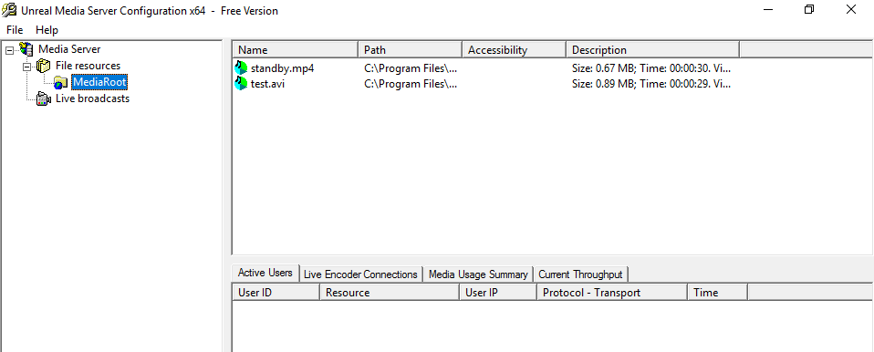

Nosotros vamos a ejecutar uno para comprobar que lo podemos ver. Para ello, vamos al navegador web y ponemos en la URL `mms://IP.DE.LA.MV:5119/MediaRoot/test.avi` y seleccionamos el reproductor de Windows Media:

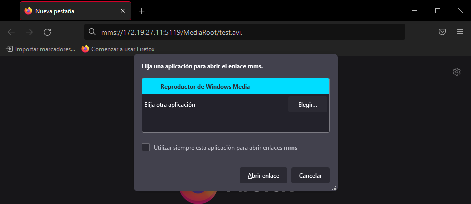

Seleccionamos la configuración recomendada del reproductor si es la primera vez que lo usamos:

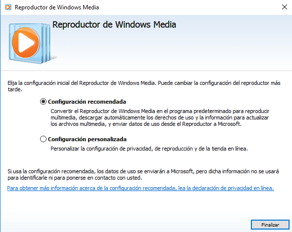

Y comprobamos que podemos ver el vídeo correctamente y en el programa nos muestra que estamos conectados al servicio:

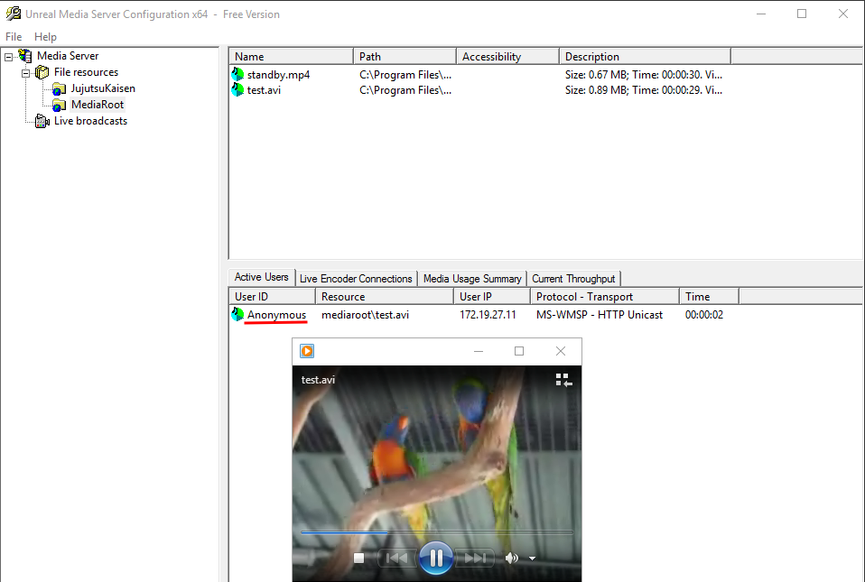

---

### 4. Creación de carpeta virtual 

Ahora vamos a crear una carpeta para poner nuestros vídeos. Para ello, le damos clic derecho en `File resources` y seleccionamos la opción `New virtual folder...`:

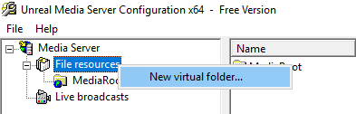

Le ponemos nombre a la carpeta virtual y le ponemos una ruta real donde tengamos alojados nuestros vídeos. El resto lo dejamos por defecto:

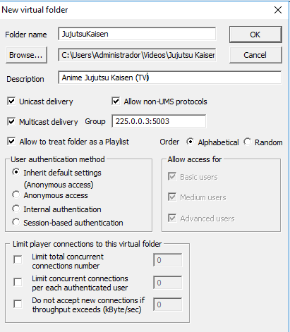

Y comprobamos que se muestran nuestros vídeos:

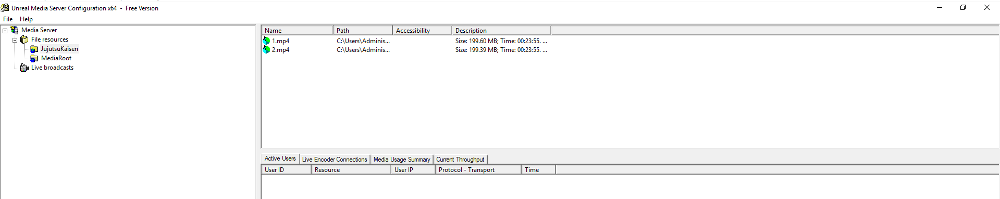

> Es recomendable usar vídeos en formato AVI en caso de reproducir en Windows, ya que el reproductor de Windows Media no tiene los códecs para reproducir vídeos MP4 en protocolo MMS.

---

### 5. Comprobación 

Finalmente vamos a reproducir nuestros vídeos. Para ello, vamos al navegador y ponemos en la URL `mms:/IP.DE.LA.MV:5119/Folder/video.avi` y seleccionamos el reproductor `VLC`, ya que Windows Media no funciona muy bien con el protocolo MMS:

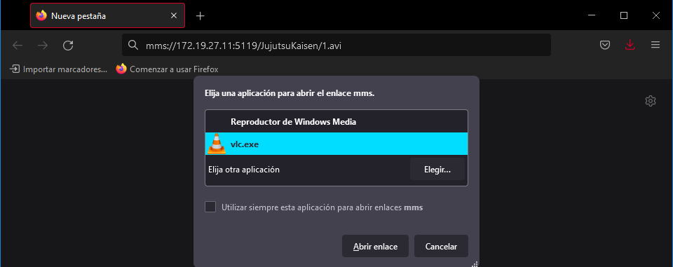

Y vemos que podemos ver el vídeo correctamente y se muestra que estamos conectados en Unreal Media Server:

Vídeo 1:

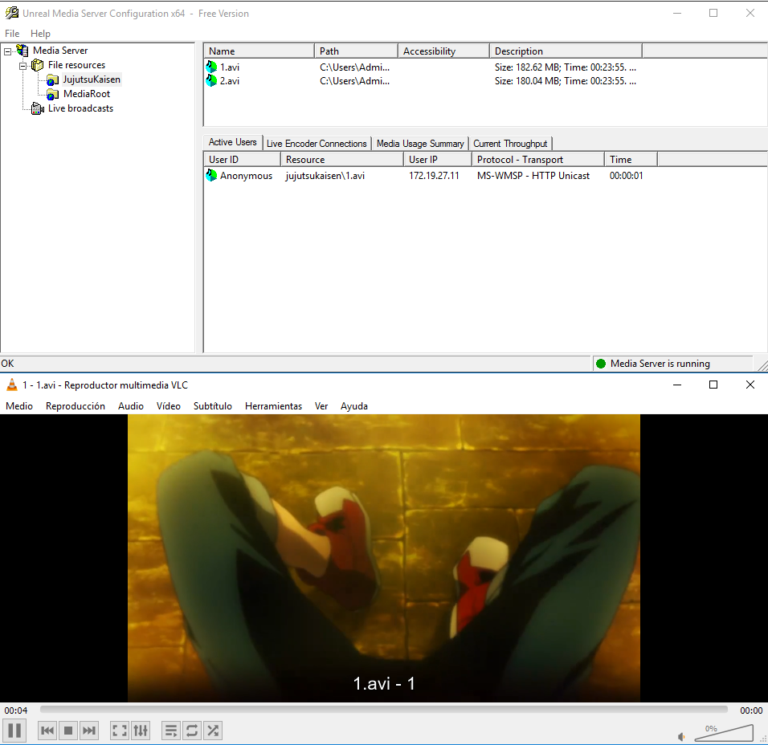

Vídeo 2:

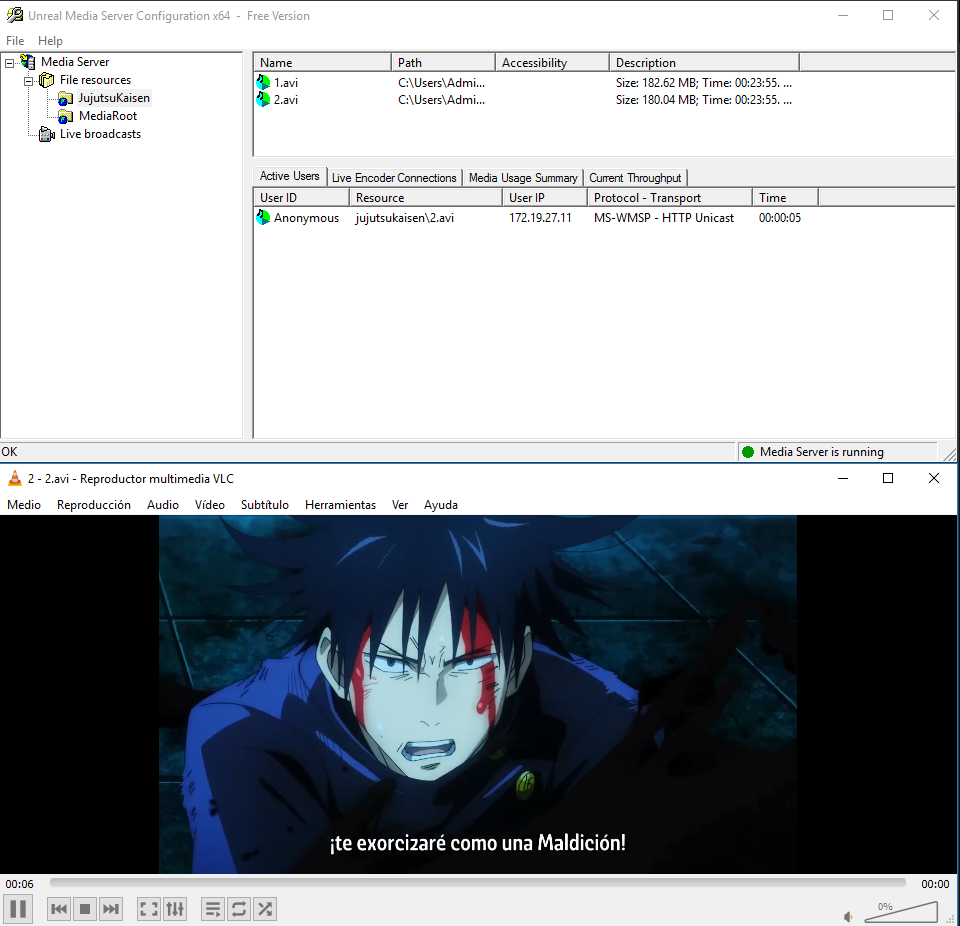
