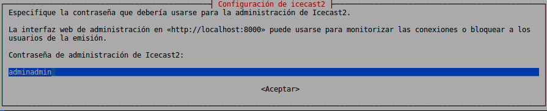
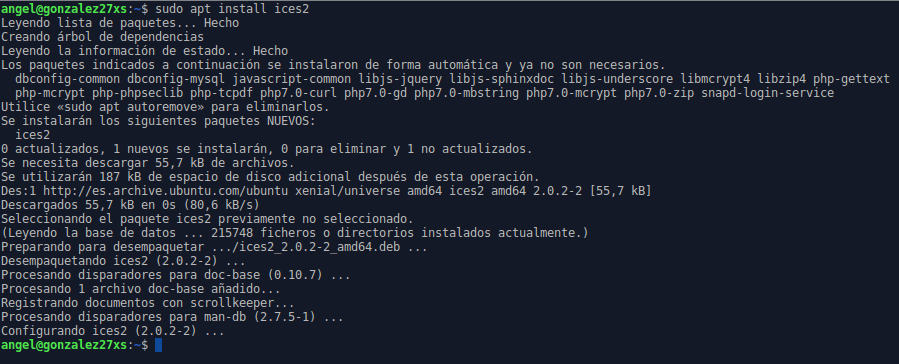
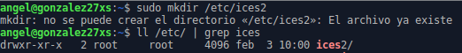
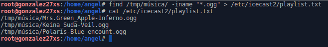
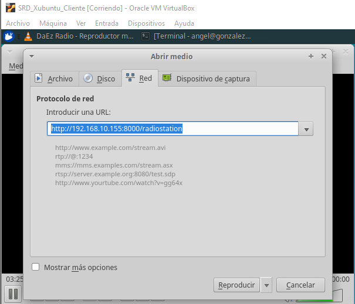

# Instalación y Configuración de un Servidor Streaming Multimedia (Audio) - Linux

---

## Índice

* [1. Instalación del servidor de audio IceCast](#1)

* [2. Configuración del servidor](#2)

* [3. Instalación y configuración del codificador vorbis ices2](#3)

* [4. Acceso y comprobación desde el entorno web](#4)

* [5. Reproducir streaming desde el reproductor VLC desde el cliente](#5)

---

### 1. Instalación del servidor de audio IceCast 

Para comenzar con esta práctica, abrimos nuestra MV de Linux Server y abrimos una terminal. Una vez dentro, instalamos el servidor de audio **IceCast** con el comando `sudo apt install icecast2`:

Nos preguntará si queremos configurar IceCast2, en mi caso, lo vamos a configurar:

En el nombre del servidor usaremos `localhost`:

Ponemos una contraseña de recursos:

Ponemos una contraseña del repetidor:

Y ponemos una contraseña de administración:

Con esto, ya tendremos el servidor instalado.

---

### 2. Configuración del servidor 

Editamos el fichero `/etc/icecast2/icecast.xml` con el comando ` sudo nano /etc/icecast2/icecast.xml` y modificamos las siguientes líneas:

~~~
<source-password>contraseña_source</source-password>
<admin-user>tu_usuario</admin-user>
<admin-password>contraseña_administrador</admin-password>
~~~

Debería quedar así:

Ahora editamos el fichero `/etc/default/icecast2` y modificamos la siguiente línea:

~~~
ENABLE=true
~~~

Finalmente iniciamos el servicio con el comando `sudo /etc/init.d/icecast2 start`:

Con esto hemos configurado e iniciado el servidor.

---

### 3. Instalación y configuración del codificador vorbis ices2 

Necesitamos el codificador vorbis ices2. Para ello, lo instalamos con el comando `sudo apt install ices2`:

Una vez instalado, creamos el directorio para el codificador `/etc/ices2` con el comando `sudo mkdir /etc/ices2`:

Y copiamos el fichero de configuración por defecto con el comando `sudo cp -r /usr/share/doc/ices2/examples/ices-playlist.xml /etc/ices2`:

Editamos el fichero de configuración y establecemos los siguientes parámetros de nuestra emisora como el siguiente ejemplo:

~~~
<name>Mi Estación de Radio</name>
<genre>Pop-Rock</genre>
<description>Radio musical dedicada al pop y al rock</description>
...
<param name=”file”>/etc/icecast2/playlist.txt</param>
...
<port>8000</port>
<password>tu_contraseña</password>
<mount>radiostation</mount>
~~~

Debería quedar así:

Copiamos las canciones que tengamos en formato `ogg`:

Generamos la lista de reproducción con el comando `find /tmp/música –iname “*.ogg” > /etc/icecast2/playlist.txt`:

Creamos el directorio log de ices2 con el comando `sudo mkdir /var/log/ices2` y ejecutamos el codificador en background con el comando `sudo ices2 /etc/ices2/ices-playlist.txt`:

---

### 4. Acceso y comprobación desde el entorno web 

Una vez activado el codificador con la playlist, vamos a acceder al entorno web. Para ello, vamos al navegador y ponemos en la URL `IP.DE.LA.MV:8000/admin`, introducimos usuario y contraseña y comprobamos que podemos acceder:

Comprobamos el estado del servicio, configuración, propiedades y punto de montaje:

Accedemos a la lista de reproducción (mountpoint) poniendo en la URL `IP.DE.LA.MV:8000/radiostation`:

Accedemos desde el cliente como invitado:

Accedemos desde el cliente como administrador:

Comprobamos que tenemos acceso como administrador desde el cliente:

---

### 5. Reproducir streaming desde el reproductor VLC desde el cliente 

Ahora en el cliente instalamos el reproductor VLC con el comando `sudo apt install vlc`:

Una vez instalado, lo ejecutamos y vamos a `Medio -> Abrir ubicación de red...`:

Introducimos la URL `IP.DE.LA.MV:8000/radiostation`:

Y comprobamos que podemos escuchar la playlist y comprobamos que la interfaz cambió de nombre al de la emisora:

Finalmente, desde el servidor, podemos comprobar que vemos la máquina cliente usando el servicio, mostrándonos su IP, tiempo de conexión y programa con el que accede al servicio:

