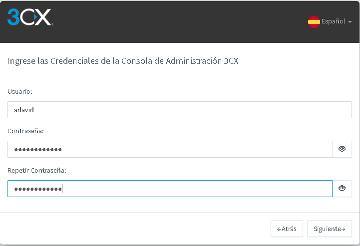
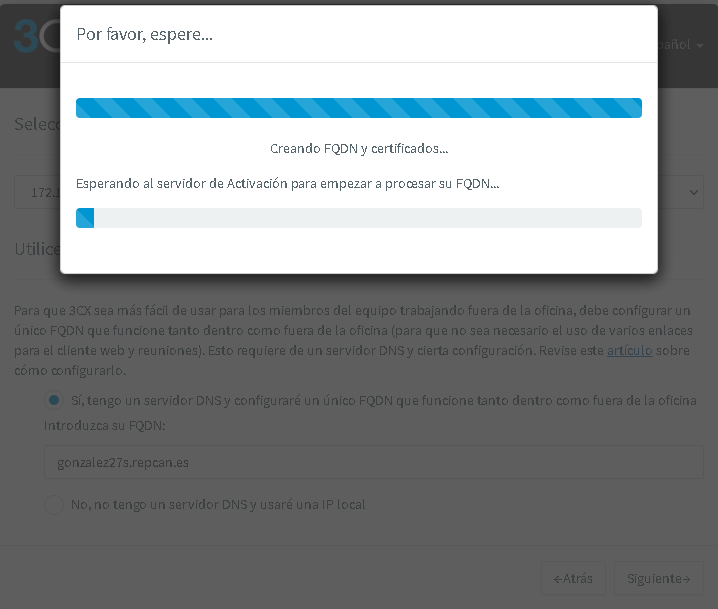

# Instalación y configuración de un Servidor de VoIP sobre Windows 2016

---

## Trabajo realizado por Ayoze Hernández y Ángel David González Quintana

---

## Índice

* [1. Registro e instalación de 3CX Phone System](#1)

* [2. Configuración del servidor](#2)

* [3. Instalación de 3CX Phone en el cliente y servidor](#3)

* [4. Creación de usuarios](#4)

* [5. Vinculaciones](#5)

* [ANEXO. Errores o problemas](#6)

---

### 1. Registro e instalación de 3CX Phone System 

Antes de empezar con esta práctica, vamos a necesitar las siguientes MVs:

* Servidor 3CX Phone System -> Windows Server 2016

* Cliente 3CX Phone -> Windows 7

* Cliente 3CX -> Dispositivo móvil

Para empezar con esta práctica, abriremos la MV de Windows Server y nos registramos en [3CX](https://www.3cx.es):

Luego nos logueamos y tendremos que completar la cuenta. Para ello, rellenamos los siguientes datos:

* **Tipo de cuenta:** Personal

* **País/Provincia:** Nuestra localización.

* **Información de contacto:** Nuestros datos.

* **Contraseña:** Ponemos la que queramos.

  

Una vez completa la información necesaria para nuestra cuenta, vamos a descargar el instalador. Para ello, vamos a `Mi Suscripción -> First Configuration -> On- Premise`:

Cambiamos el nombre de dominio sugerido:

Y seleccionamos la instalación para Windows:

Una vez descargado el instalador, lo ejecutamos y procedemos con los pasos de instalación:

* **Requisitos:** Solo nos dirá que requisitos necesitamos para instalar 3CX Phone System, por lo que seguimos:

  

* **Recomendaciones:** Solo nos recomendará algunas acciones, por lo que seguimos:

  

* **Términos de licencia:** Leemos y aceptamos:

  

* **Directorio de instalación:** Seleccionamos la ruta de instalación que queramos, aunque lo podemos dejar por defecto:

  

Una vez realizados los pasos, el servicio se instalará:

---

### 2. Configuración del servidor 

Una vez instalado, se abrirá la siguiente interfaz de texto con dos opciones de realizar la configuración, seleccionamos la opción de configuración a través del navegador web:

Se abrirá una página con la instalación y configuración del servidor, por lo que seguiremos los siguientes pasos:

* **Tipo de instalación:** Crear una nueva instalación del Sistema Telefónico 3CX (Ponemos la clave de licencia en nuestro perfil `My subscription` en 3CX):

  

* **Credenciales de la consola de administración 3CX:** Ponemos usuario y contraseña:

  

* **Dirección IP Pública:** Seleccionamos la primera opción:

  

* **Tipo de IP Pública:** Estática:

  

* **Selección de puertos:** Lo dejamos por defecto:

  

* **Adaptador de red:** Seleccionamos el único que tenemos.

* **FQDN:** Pondremos nuestro FQDN o dominio.

  

  

* **Longuitud de las extensiones:** 3 Dígitos:

  

* **Email del administrador:** Ponemos nuestro correo:

  

* **País y Zona Horaria:** Ponemos nuestros datos:

  

* **Extensión del operador:** Creamos un usuario operador:

  

* **Países a los que puede llamar:** Europa:

  

* **Idioma:** Spanish Prompts Set:

  

* **Información de Registro:** Ponemos nuestros datos (El ID de Partner es opcional)

  

Finalmente ya tendríamos 3CX instalado y configurado:

---

### 3. Instalación de 3CX Phone en el cliente y servidor 

Ahora tanto en el servidor como en el cliente Windows, realizaremos la siguiente instalación.

Vamos a la página de [3CX Softphone](https://www.3cx.es/voip-telefono/softphone/) y descargamos el instalador:

Una vez descargado, lo ejecutamos y seguiremos los siguientes pasos de instalación:

* **Bienvenida:** Nos dará la bienvenida. Seguimos:

  

* **Términos de licencia:** Las leemos y aceptamos:

  

* **Directorio de instalación:** Seleccionamos la ruta de instalación:

  

Finalmente se instalará y se abrirá la siguiente interfaz. Lo dejamos como está:

---

### 4. Creación de usuarios 

Ahora accedemos al enlace que nos sale al finalizar la configuración del servidor 3CX Phone System y nos logueamos:

Nos saldrá un código QR de instalación de 3CX para dispositivos móviles:

Crearemos 3 usuarios con los datos que queramos:

Y debería quedar así:

---

### 5. Vinculaciones 

Primero vinculamos el teléfono del servidor, para ello, le damos a `Auto Provision` y en `Teléfonos` nos saldrá el intento de acceso, lo seleccionamos y le damos a `Asignar Ext`:

Seleccionamos el usuario:

Le damos en `Aceptar`:

Y el teléfono del servidor ya estaría vinculado al usuario operador:

Comprobamos que el usuario vinculado está operativo:

Ahora vinculamos el teléfono cliente, para ello, le damos `Auto Provision` y en `Teléfonos` nos saldrá el intento de acceso, lo seleccionamos y le damos a `Asignar Ext`:

Seleccionamos el usuario:

Aceptamos y el teléfono del cliente ya estaría vinculado al usuario. Comprobamos que el usuario vinculado está operativo:

Finalmente podemos marcar la extensión de un teléfono a otro y podemos llamar correctamente.

---

### ANEXO. Errores o problemas 

No he podido realizar capturas de las llamadas debido a que el servidor no me permite acceder a la página web de administración, supongo a que tenía la dirección IP dinámica y este perdió la señal. Pero pude realizar las llamadas cuando hice la práctica y funcionaban.

Intenté acceder al usuario **Salva** desde mi teléfono móvil pero el código QR no funcionaba y manualmente tampoco.
