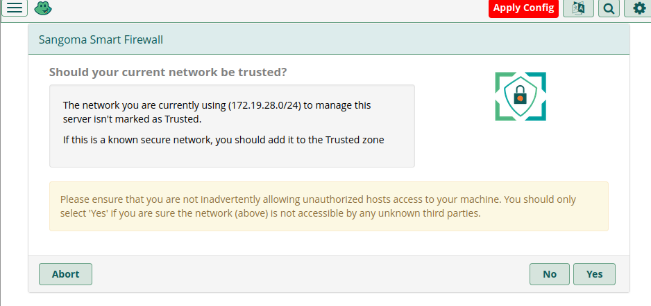
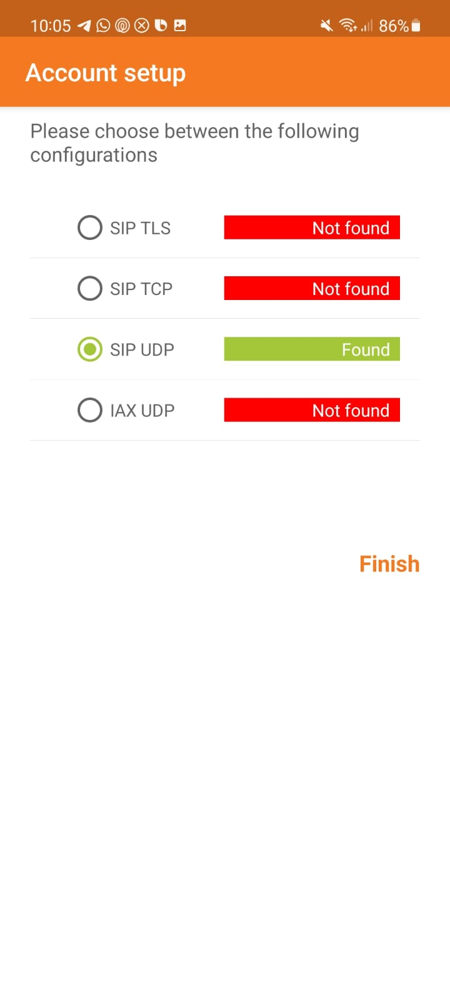

# Instalación de servidor VoIP en Linux: FreePBX

---

Trabajo realizado por: Ángel David González y Ayoze Hernández.

Curso: Administración de Sistemas Informáticos en Redes.

---

### ÍNDICE

+ [Instalación](#id1)
+ [Configuración](#id2)
+ [Creación de usuarios](#id3)
+ [Conexión entre dispositivos](#id4)

#### ***Instalación***. 

Empezamos instalando la ISO de [FreePBX](https://www.freepbx.org/) e instalandola.

Debemos establecer una contraseña para el root. (Por motivos de seguridad no se muestra).

Una vez añadimos la contraseña se instalan los componentes necesarios.

#### ***Configuración***. 

Accedemos a la página de configuración web de FreePBX mediante la IP de la máquina en cuestión.

Ahora procedemos a configurar el servidor con opciones por defecto.

Aquí debemos añadir nuestros datos de contacto (Pueden ser inventados).

Activamos el servidor con el comando: fwconsole sysadmin activate **clave**; la clave se nos proporciona al hacer click en "Activate".

Ya el resto de opciones que viene son por defecto por lo que no hay mucho que explicar de ellas.

#### ***Creación de usuarios***. 

Para añadir un usuario debemos ir a **Applications>Extensions>Add-Extension**.

En la sección general añadimos los datos personales del usuario además de la contraseña e identificadores. Además podemos elegir entre 2 idiomas para el usuario.

En la sección avanzada debemos de cambiar la sección DTMF Signaling a automática.

Añadimos otro usuario de la misma manera.

#### ***Conexión entre dispositivos***. 

Instalamos la aplicación de móvil e intentamos conectarnos con el servidor VoIP y vemos que nos reconoce el servicio SIP UDP.

Conectamos una cuenta.

Llamamos a la otra cuenta.

Comprobamos que recibe la llamada desde otro dispositivo y que suena a continuación.

Vemos que con exito se ha realizado la llamada.

